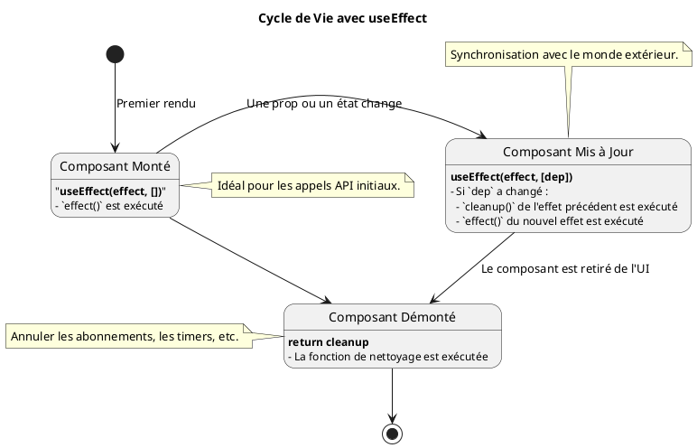
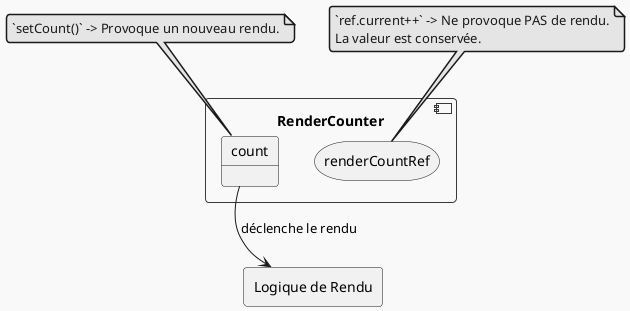
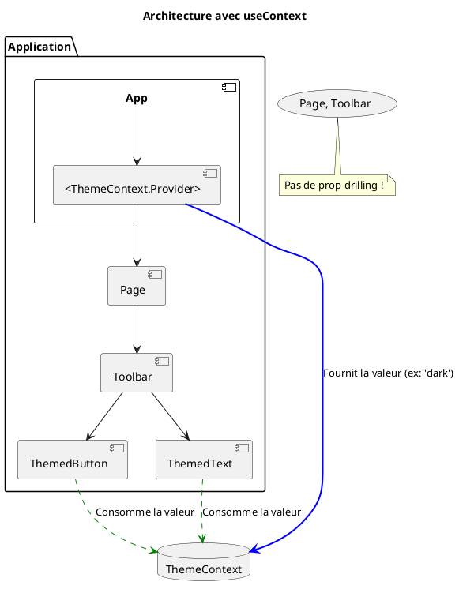

# Module 2 : Le Cycle de Vie et les Hooks Essentiels

Bravo d'avoir maîtrisé les fondamentaux ! Vos composants savent maintenant afficher des informations et réagir à des
actions simples. Mais une véritable application doit faire plus : elle doit communiquer avec un serveur, s'adapter à l'
environnement du navigateur, ou partager une information globale sans la passer de main en main à travers des dizaines
de composants.

Ce module vous présente les outils qui transforment vos composants en véritables acteurs de votre application : les
Hooks essentiels. Ils sont la clé pour gérer des logiques plus complexes et des effets de bord.

## Objectifs Pédagogiques

À la fin de ce module, vous serez capable de :

* **Gérer** les effets de bord (comme les appels API ou les abonnements) avec le hook `useEffect`.
* **Comprendre** et maîtriser le cycle de vie d'un composant fonctionnel (montage, mise à jour, démontage).
* **Accéder** directement aux éléments du DOM de manière contrôlée avec le hook `useRef`.
* **Stocker** des valeurs persistantes qui ne déclenchent pas de nouveaux rendus.
* **Résoudre** le problème du "prop drilling" en partageant un état global simple avec le hook `useContext`.

## Pourquoi ce module est-il important ?

Imaginez que vos composants sont des acteurs sur une scène de théâtre. Jusqu'à présent, vous leur avez appris leur
texte (`props`) et comment changer d'émotion (`state`). Mais que se passe-t-il quand un acteur doit interagir avec les
coulisses ? Par exemple, aller chercher un accessoire (données d'une API), écouter une annonce du régisseur (un
abonnement WebSocket), ou allumer un projecteur spécifique (manipuler le DOM) ?

Les Hooks que nous allons voir sont les "oreillettes" et les "instructions de mise en scène" de vos acteurs. Sans eux,
vos composants resteraient isolés sur leur scène. `useEffect`, `useRef` et `useContext` sont les trois outils qui
connectent vos composants au reste de l'écosystème de l'application et du navigateur, les rendant infiniment plus
puissants.

## Compétences du Référentiel (REAC)

Ce module renforce et étend les compétences du bloc **CCP-1 : Concevoir et développer des composants d'interface
utilisateur**.

* **Développer des composants d’accès aux données :** `useEffect` est le principal outil pour initier des appels vers
  des API pour récupérer des données.
* **Préparer et tester un déploiement :** La bonne gestion du cycle de vie et des effets de bord est cruciale pour des
  applications stables et performantes.

---

## 1. `useEffect` : Gérer les effets de bord

Vos composants ont un travail principal : calculer et retourner du JSX pour décrire l'UI. C'est ce qu'on appelle un "
rendu pur". Mais parfois, ils doivent faire des choses qui ne sont pas liées au rendu lui-même. C'est ce qu'on appelle
des **effets de bord** (ou *side effects*).

<procedure title="L'analogie de l'assistant personnel">
<p>
Imaginez que vous êtes un manager très occupé (le composant React) dont le seul travail est de décider de l'apparence de votre bureau (le rendu JSX). Vous ne voulez pas être dérangé par des tâches annexes.
</p>
<div>
Vous engagez donc un assistant (`useEffect`). Vous lui donnez des instructions très précises :

<ul>
    <li>"Dès que j'arrive le matin (<b>au montage</b>), va me chercher le café (<b>fetch des données</b>)."</li>
    <li>"Chaque fois que je reçois un nouveau dossier important sur mon bureau (<b>quand une dépendance change</b>), mets à jour le titre sur ma porte (<b>update le document.title</b>)."</li>
    <li>"Quand je pars le soir (<b>au démontage</b>), n'oublie pas d'éteindre la machine à café (<b>nettoyer un abonnement</b>)."</li>

</ul>

`useEffect` est cet assistant qui exécute des tâches en réponse au cycle de vie de votre composant, sans polluer sa logique principale de rendu.

</div>

</procedure>

`useEffect` est un hook qui prend deux arguments :

1. Une **fonction** à exécuter (l'effet).
2. Un **tableau de dépendances** (optionnel) qui dit à React *quand* ré-exécuter l'effet.

#### Cas 1 : Exécution au montage du composant

Pour exécuter une action une seule fois, juste après le premier rendu du composant, on fournit un tableau de dépendances
vide `[]`.

**Exemple : Changer le titre de la page au chargement**

```javascript
import React, {useState, useEffect} from 'react';

function DocumentTitleUpdater() {
    const [clickCount, setClickCount] = useState(0);

    // Ce `useEffect` s'exécute UNE SEULE FOIS après le premier rendu.
    useEffect(() => {
        // C'est un effet de bord : on interagit avec le navigateur (le DOM)
        // en dehors de la logique de rendu du composant.
        document.title = 'Bienvenue sur ma page !';
        console.log("L'effet a été exécuté !");
    }, []); // Le tableau vide signifie "ne dépend de rien"

    return (
        <div>
            <p>Regardez l'onglet de votre navigateur !</p>
            <button onClick={() => setClickCount(clickCount + 1)}>
                Cliqué {clickCount} fois
            </button>
            {/* Chaque clic re-rend le composant, mais l'effet ne se 
          redéclenche pas. */}
        </div>
    );
}
```

#### Cas 2 : Exécution à la mise à jour d'une dépendance

Pour exécuter l'effet à chaque fois qu'une valeur spécifique (une prop ou une variable de state) change.

**Exemple : Mettre à jour le titre de la page avec un compteur**

```javascript
import React, {useState, useEffect} from 'react';

function ClickCounterTitle() {
    const [count, setCount] = useState(0);

    // Cet effet s'exécute après le premier rendu ET
    // à chaque fois que la valeur de `count` change.
    useEffect(() => {
        document.title = `Vous avez cliqué ${count} fois`;
        console.log(`Le titre a été mis à jour avec la valeur ${count}.`);
    }, [count]); // `count` est dans le tableau de dépendances.

    return (
        <div>
            <p>
                Regardez le titre de l'onglet pendant que vous cliquez.
            </p>
            <button onClick={() => setCount(count + 1)}>
                Cliquez ici
            </button>
        </div>
    );
}
```

#### Cas 3 : Nettoyage (démontage)

Parfois, un effet met en place quelque chose qui doit être "annulé" lorsque le composant disparaît (démontage) pour
éviter des fuites de mémoire. Exemples : un abonnement à un service, un timer `setInterval`. Pour cela, la fonction de
`useEffect` peut retourner une autre fonction, appelée **fonction de nettoyage**.

**Exemple : Un timer qui se nettoie tout seul**

```javascript
import React, {useState, useEffect} from 'react';

function TickingClock() {
    const [time, setTime] = useState(new Date());

    useEffect(() => {
        // Effet : démarrer un intervalle qui met à jour l'heure chaque seconde
        const timerId = setInterval(() => {
            setTime(new Date());
            console.log('Tick');
        }, 1000);

        // Fonction de nettoyage :
        // Elle sera appelée quand le composant sera retiré de l'écran.
        return () => {
            clearInterval(timerId);
            console.log('Le timer a été nettoyé.');
        };
    }, []); // On veut que le timer soit créé une seule fois.

    return (
        <p>Heure actuelle : {time.toLocaleTimeString()}</p>
    );
}
```



### Exercice 6 : Simuler un chargement de données

**Objectif :** Créer un composant qui affiche un message de chargement, puis, après 2 secondes, affiche des données "
récupérées".

1. Créez un composant `UserData`.
2. Utilisez deux états : `loading` (booléen, initialisé à `true`) et `user` (objet, initialisé à `null`).
3. Utilisez `useEffect` pour simuler un appel API qui se déclenche une seule fois au montage.
4. À l'intérieur de l'effet, utilisez `setTimeout` pour attendre 2 secondes.
5. Après 2 secondes, passez `loading` à `false` et mettez à jour `user` avec un objet (ex: `{ name: 'John Doe' }`).
6. Dans le JSX, affichez "Chargement..." si `loading` est `true`, sinon affichez le nom de l'utilisateur.

#### Correction exercice 6 {collapsible="true"}

```javascript
import React, {useState, useEffect} from 'react';

function UserData() {
    const [isLoading, setIsLoading] = useState(true);
    const [user, setUser] = useState(null);

    useEffect(() => {
        // On simule une requête réseau qui prend du temps.
        const fakeApiCall = setTimeout(() => {
            const fetchedUser = {name: 'Jane Doe', email: 'jane@example.com'};
            setUser(fetchedUser);
            setIsLoading(false);
        }, 2000); // 2 secondes de délai

        // C'est une bonne pratique de nettoyer le timeout
        // si le composant est démonté avant la fin.
        return () => clearTimeout(fakeApiCall);
    }, []); // Tableau vide pour exécuter au montage uniquement.

    if (isLoading) {
        return <p>Chargement des données...</p>;
    }

    return (
        <div>
            <h2>Données de l'utilisateur :</h2>
            <p>Nom : {user.name}</p>
            <p>Email : {user.email}</p>
        </div>
    );
}

export default UserData;
```

---

## 2. `useRef` : Les Références

Parfois, vous avez besoin d'interagir directement avec un élément du DOM (par exemple, pour gérer le focus d'un champ)
ou de conserver une valeur entre les rendus sans pour autant déclencher un nouveau rendu. C'est le rôle de `useRef`.

<procedure title="L'analogie de l'étiquette et de la poche secrète">
<p>
`useRef` a deux super-pouvoirs :
</p>
<p>
1. <b>L'étiquette :</b> Imaginez que vous voulez retrouver un livre précis dans une immense bibliothèque. Au lieu de le chercher à chaque fois, vous y collez une grosse étiquette fluo (`ref`). Désormais, pour le retrouver, il suffit de chercher l'étiquette. `useRef` vous permet de "coller une étiquette" sur un élément JSX pour y accéder directement plus tard.
</p>
<p>
2. <b>La poche secrète :</b> Imaginez que vous êtes un magicien. Vous avez besoin de garder un objet dans votre poche sans que le public (le système de rendu de React) ne le voie. Si vous le mettez dans votre main (`useState`), tout le monde le voit et réagit. Si vous le mettez dans votre poche secrète (`useRef`), vous pouvez le modifier discrètement, sa valeur persiste, mais cela ne déclenche pas une nouvelle "scène" (un nouveau rendu).
</p>
</procedure>

`useRef` retourne un objet avec une seule propriété : `current`. `myRef.current`.

#### Cas 1 : Accéder aux éléments du DOM

C'est l'utilisation la plus courante. Parfait pour gérer le focus, déclencher des animations ou mesurer la taille d'un
élément.

**Exemple : Mettre le focus sur un champ de saisie au chargement**

```javascript
import React, {useRef, useEffect} from 'react';

function AutoFocusInput() {
    // 1. Créez la ref.
    const inputRef = useRef(null);

    // On utilise useEffect pour s'assurer que le DOM est bien rendu.
    useEffect(() => {
        // 3. Après le rendu, l'élément DOM est dans `inputRef.current`.
        // On peut maintenant appeler ses méthodes natives.
        if (inputRef.current) {
            inputRef.current.focus();
        }
    }, []);

    return (
        <div>
            <label>
                Votre nom :
                {/* 2. Attachez la ref à l'élément JSX. */}
                <input ref={inputRef} type="text"/>
            </label>
        </div>
    );
}
```

#### Cas 2 : Stocker des valeurs persistantes

Utile pour les valeurs qui doivent "survivre" aux re-renders, mais dont le changement ne doit pas en provoquer un.
Parfait pour les identifiants de timers, les compteurs internes, etc.

<warning title="useRef vs useState">

*   Modifier `myRef.current` **ne provoque PAS** de nouveau rendu.
*   Appeler `setState(...)` **provoque** un nouveau rendu.

Choisissez `useRef` pour les données "silencieuses" et `useState` pour les données qui doivent être visibles dans l'UI.

</warning>

### Exercice 7 : Compter le nombre de rendus

**Objectif :** Créer un composant qui affiche combien de fois il a été rendu.

1. Créez un composant `RenderCounter`.
2. Utilisez `useState` pour stocker une valeur de compteur qui s'incrémente au clic sur un bouton.
3. Utilisez `useRef` pour stocker le nombre de rendus. Initialisez-le à 1.
4. À chaque exécution de la fonction du composant (c'est-à-dire à chaque rendu), incrémentez `myRef.current`.
5. Affichez la valeur du compteur *et* la valeur du nombre de rendus. Observez la différence de comportement.

#### Correction exercice 7 {collapsible="true"}

```javascript
import React, {useState, useRef, useEffect} from 'react';

function RenderCounter() {
    const [count, setCount] = useState(0);

    // La ref va persister entre les rendus.
    const renderCountRef = useRef(0);

    // Cette ligne est exécutée à chaque rendu.
    renderCountRef.current = renderCountRef.current + 1;

    // Note : On pourrait aussi utiliser un useEffect pour être plus
    // sémantique, mais pour ce cas simple, c'est acceptable.
    // useEffect(() => {
    //   renderCountRef.current = renderCountRef.current + 1;
    // });

    return (
        <div>
            <p>Compteur (état) : {count}</p>
            <p>Ce composant a été rendu {renderCountRef.current} fois.</p>
            <button onClick={() => setCount(c => c + 1)}>
                Provoquer un nouveau rendu
            </button>
        </div>
    );
}

export default RenderCounter;
```



---

## 3. `useContext` : Partager l'état simplement

Vous est-il déjà arrivé de devoir passer un objet de props à travers 5 niveaux de composants juste pour qu'il arrive au
dernier ? C'est ce qu'on appelle le **"prop drilling"** (forage de props). C'est lourd, répétitif et difficile à
maintenir.

<procedure title="L'analogie du système d'annonce public">
<p>
Imaginez un grand immeuble de bureaux. Le PDG (le composant `App`) veut communiquer une information importante à tous les employés, comme le "thème de la journée" (par exemple, "journée casual" ou "journée formelle").
</p>
<p>
<b>La méthode "Prop Drilling" :</b> Le PDG appelle son manager, qui appelle son chef d'équipe, qui appelle son superviseur, qui finalement prévient l'employé au fond du bureau. L'information est passée de main en main, même par des gens qui n'en ont rien à faire. C'est inefficace.
</p>
<p>
<b>La méthode `useContext` :</b> Le PDG utilise le système d'annonce public de l'immeuble (`Context.Provider`). Il diffuse le message : "Aujourd'hui, c'est journée casual". N'importe quel employé, à n'importe quel étage, qui a une radio branchée sur la bonne fréquence (`useContext`) entend le message directement, sans intermédiaire.
</p>
</procedure>

`useContext` permet de créer un "conduit" de données accessibles par n'importe quel composant enfant, peu importe sa
profondeur dans l'arbre.

Le processus se fait en 3 étapes :

1. **Créer le Contexte :** On définit le "canal radio".
   ```javascript
   // theme-context.js
   import { createContext } from 'react';
   export const ThemeContext = createContext('light'); // 'light' est la valeur par défaut
   ```
2. **Fournir le Contexte :** On enveloppe une partie de notre application avec le `Provider` pour diffuser une valeur.
   ```javascript
   // App.js
   import { ThemeContext } from './theme-context';
   
   function App() {
     const [theme, setTheme] = useState('dark');
     return (
       <ThemeContext.Provider value={theme}>
         {/* Tous les enfants ici peuvent accéder à la valeur 'dark' */}
         <MyPage />
       </ThemeContext.Provider>
     );
   }
   ```
3. **Consommer le Contexte :** Un composant enfant utilise le hook `useContext` pour s'abonner et lire la valeur.
   ```javascript
   // Button.js
   import { useContext } from 'react';
   import { ThemeContext } from './theme-context';
   
   function ThemedButton() {
     const theme = useContext(ThemeContext); // theme sera 'dark'
     return <button className={`theme-${theme}`}>Mon bouton</button>;
   }
   ```




### Exercice 8 : Mettre en place un contexte utilisateur

**Objectif :** Partager les informations d'un utilisateur connecté sans prop drilling.

1. Créez un fichier `UserContext.js` et exportez un `UserContext` créé avec `createContext`.
2. Dans `App.js`, simulez un utilisateur connecté avec `useState` (ex: `{ name: 'Alice', isLoggedIn: true }`).
3. Enveloppez vos composants enfants avec `UserContext.Provider` et passez-y l'objet utilisateur.
4. Créez un composant `Header`. À l'intérieur, créez un composant `UserDisplay`.
5. `App` rend `Header`, qui lui-même rend `UserDisplay`.
6. `UserDisplay` doit utiliser `useContext(UserContext)` pour récupérer les infos de l'utilisateur et afficher "Bonjour,
   Alice !" ou "Veuillez vous connecter." sans qu'aucune prop ne soit passée par `Header`.

#### Correction exercice 8 {collapsible="true"}

<tabs>
<tab title="UserContext.js">

```javascript
// src/contexts/UserContext.js
import { createContext } from 'react';

// On peut passer un objet par défaut pour une meilleure auto-complétion
const defaultUserValue = {
user: null,
setUser: () => {} // une fonction vide par défaut
};

export const UserContext = createContext(defaultUserValue);
```

</tab>
<tab title="UserDisplay.js">

```javascript
// src/components/UserDisplay.js
import React, { useContext } from 'react';
import { UserContext } from '../contexts/UserContext';

function UserDisplay() {
  // On récupère la valeur fournie par le Provider le plus proche
  const { user } = useContext(UserContext);

  return (
    <div>
      {user && user.isLoggedIn 
        ? <p>Bonjour, {user.name} !</p>
        : <p>Veuillez vous connecter.</p>
      }
    </div>
  );
}

export default UserDisplay;
```

</tab>
<tab title="Header.js">

```javascript
// src/components/Header.js
import React from 'react';
import UserDisplay from './UserDisplay';

// Ce composant ne sait rien de l'utilisateur, il ne fait que passer le relais.
// C'est l'exemple parfait de ce qu'on évite avec le context.
function Header() {
return (
<header style={{ borderBottom: '1px solid black', padding: '10px' }}>
<h1>Mon Site</h1>
<UserDisplay />
</header>
);
}

export default Header;

```
</tab>
<tab title="App.js">

```javascript
// src/App.js
import React, { useState } from 'react';
import { UserContext } from './contexts/UserContext';
import Header from './components/Header';

function App() {
  const [user, setUser] = useState({ 
    name: 'Alice', 
    isLoggedIn: true 
  });

  return (
    // On passe l'objet utilisateur dans la `value` du Provider.
    // Tous les composants enfants peuvent maintenant y accéder.
    <UserContext.Provider value={{ user, setUser }}>
      <div className="App">
        <Header />
        <main>
          <p>Contenu principal de la page...</p>
        </main>
      </div>
    </UserContext.Provider>
  );
}

export default App;
```

</tab>
</tabs>

---

## TP : Créer un blog simple avec un thème personnalisable

Combinons tout ce que nous avons appris pour créer une petite application qui charge des articles de blog depuis une
fausse API et permet à l'utilisateur de basculer entre un thème clair et un thème sombre.

### Étape 1 : Le Contexte du Thème

* Créez un `ThemeContext.js`.
* Dans `App.js`, créez un état `theme` ('light' ou 'dark') avec `useState`.
* Créez une fonction `toggleTheme` qui inverse le thème.
* Entourez votre application avec un `ThemeContext.Provider` et fournissez un objet contenant le `theme` actuel et la
  fonction `toggleTheme`.

### Étape 2 : Le Hook personnalisé `useFetch`

* Créez un fichier `hooks/useFetch.js`.
* À l'intérieur, créez une fonction `useFetch(url)`.
* Ce hook doit utiliser `useState` pour gérer les états `data`, `loading` et `error`.
* Il doit utiliser `useEffect` pour lancer une requête `fetch` vers l'URL fournie lors de son montage.
* Mettez à jour les états en fonction du résultat de la requête.
* Le hook doit retourner `{ data, loading, error }`.

### Étape 3 : Afficher les articles

* Créez un composant `PostList`.
* Utilisez votre hook `useFetch` pour charger les articles depuis `https://jsonplaceholder.typicode.com/posts`.
* Gérez les cas `loading` et `error`.
* Si les données sont là, mappez dessus pour afficher une liste de titres d'articles.

### Étape 4 : Le bouton de changement de thème

* Créez un composant `ThemeToggleButton`.
* Utilisez `useContext` pour récupérer `theme` et `toggleTheme` depuis `ThemeContext`.
* Affichez un bouton qui, au clic, appelle `toggleTheme`.
* Le texte du bouton doit changer en fonction du thème actuel (ex: "Passer au thème sombre").

### Étape 5 : Assemblage et stylisation

* Dans `App.js`, affichez le `ThemeToggleButton` et le `PostList`.
* Ajoutez une classe CSS sur la `div` principale de `App.js` qui dépend du thème (`<div className={theme}>`).
* Dans votre fichier CSS, définissez des styles pour `.light` et `.dark` (couleur de fond, couleur de texte).

### Correction du TP {collapsible="true"}

<tabs>
<tab title="ThemeContext.js">

```javascript
// src/contexts/ThemeContext.js
import { createContext } from "react";

export const ThemeContext = createContext({
theme: 'light',
toggleTheme: () => {},
});

```
</tab>

<tab title="useFetch.js">

```javascript
// src/hooks/useFetch.js
import { useState, useEffect } from 'react';

function useFetch(url) {
  const [data, setData] = useState(null);
  const [loading, setLoading] = useState(true);
  const [error, setError] = useState(null);

  useEffect(() => {
    const fetchData = async () => {
      try {
        const response = await fetch(url);
        if (!response.ok) {
          throw new Error(`Erreur HTTP: ${response.status}`);
        }
        const jsonData = await response.json();
        setData(jsonData);
      } catch (e) {
        setError(e);
      } finally {
        setLoading(false);
      }
    };

    fetchData();

    // Il n'y a pas de nettoyage nécessaire pour un simple fetch.
  }, [url]); // Se redéclenche si l'URL change.

  return { data, loading, error };
}

export default useFetch;
```

</tab>
<tab title="ThemeToggleButton.js">

```javascript
// src/components/ThemeToggleButton.js
import React, { useContext } from 'react';
import { ThemeContext } from '../contexts/ThemeContext';

function ThemeToggleButton() {
const { theme, toggleTheme } = useContext(ThemeContext);

return (
<button onClick={toggleTheme}>
Passer au thème {theme === 'light' ? 'sombre' : 'clair'}
</button>
);
}

export default ThemeToggleButton;

```
</tab>
<tab title="PostList.js">

```javascript
// src/components/PostList.js
import React from 'react';
import useFetch from '../hooks/useFetch';

function PostList() {
  const { data: posts, loading, error } = useFetch(
    'https://jsonplaceholder.typicode.com/posts?_limit=10'
  );

  if (loading) return <p>Chargement des articles...</p>;
  if (error) return <p>Une erreur est survenue : {error.message}</p>;

  return (
    <div>
      <h2>Articles récents</h2>
      <ul>
        {posts && posts.map(post => <li key={post.id}>{post.title}</li>)}
      </ul>
    </div>
  );
}

export default PostList;
```

</tab>
<tab title="App.js">

```javascript
// src/App.js
import React, { useState } from 'react';
import { ThemeContext } from './contexts/ThemeContext';
import ThemeToggleButton from './components/ThemeToggleButton';
import PostList from './components/PostList';
import './App.css';

function App() {
const [theme, setTheme] = useState('light');

const toggleTheme = () => {
setTheme(currentTheme => (currentTheme === 'light' ? 'dark' : 'light'));
};

return (
<ThemeContext.Provider value={{ theme, toggleTheme }}>
<div className={`App ${theme}`}>
<header>
<h1>Mon Super Blog</h1>
<ThemeToggleButton />
</header>
<main>
<PostList />
</main>
</div>
</ThemeContext.Provider>
);
}

export default App;

```
</tab>
<tab title="App.css">

```css
/* App.css */
.App {
  min-height: 100vh;
  padding: 20px;
  transition: background-color 0.3s, color 0.3s;
}

.App.light {
  background-color: #ffffff;
  color: #333333;
}

.App.dark {
  background-color: #333333;
  color: #ffffff;
}

.App.dark button {
  background-color: #555;
  color: #fff;
  border: 1px solid #777;
}
```

</tab>
</tabs>

---

## Auto-évaluation

Testez vos connaissances ! Les réponses se trouvent à la toute fin du support de cours.

#### Questions à Choix Multiple (QCM)

**1. Dans quel cas le `useEffect` suivant sera-t-il exécuté ? `useEffect(() => { ... }, [user]);`**

1. Seulement une fois, quand le composant est monté.
2. À chaque rendu du composant.
3. Quand le composant est monté, et à chaque fois que la référence de l'objet `user` change.
4. Seulement quand le composant est démonté.

**2. Quelle est la principale raison d'utiliser `useRef` au lieu de `useState` ?**

1. Pour stocker des chaînes de caractères complexes.
2. Pour modifier une valeur et déclencher un nouveau rendu de l'interface.
3. Pour stocker une valeur qui persiste entre les rendus sans déclencher de nouveau rendu lors de sa modification.
4. `useRef` est une ancienne version de `useState`.

**3. Que résout principalement le hook `useContext` ?**

1. Le problème des appels API qui échouent.
2. Le besoin de passer des props à travers de multiples niveaux de composants intermédiaires (prop drilling).
3. La difficulté de styliser des composants React.
4. La gestion des événements du clavier.

#### Questions Ouvertes

**4. Décrivez une situation concrète où vous devriez utiliser la fonction de nettoyage retournée par `useEffect`. Quel
est le risque si vous ne le faites pas ?**

**5. Vous avez un composant `Timer` qui affiche un compteur s'incrémentant chaque seconde. Vous utilisez `setInterval`
pour cela. Quel hook utiliseriez-vous pour stocker l'ID de l'intervalle afin de pouvoir l'arrêter plus tard
avec `clearInterval` ? Expliquez votre choix.**

---

## Conclusion de ce module

Vous venez d'ajouter trois outils incroyablement puissants à votre arsenal de développeur React. Vous n'êtes plus limité
à la simple création d'interfaces ; vous pouvez désormais orchestrer des logiques complexes.

Avec `useEffect`, vous maîtrisez le **cycle de vie** de vos composants et gérez les **effets de bord**. Avec `useRef`,
vous avez une porte d'entrée vers le **DOM** et une "poche secrète" pour vos données persistantes. Et avec `useContext`,
vous pouvez créer des **états globaux** partagés pour des applications plus propres et plus maintenables.

Dans le prochain module, nous allons nous concentrer sur la manière d'afficher des données de manière efficace et
performante. Nous aborderons le rendu de listes, le rendu conditionnel, et nous introduirons des techniques
d'optimisation pour que vos applications restent fluides et rapides, même lorsqu'elles deviennent complexes.

## Suggestions de projets pour pratiquer

1. **Niveau Débutant : Horloge en temps réel**
    * **Description :** Affichez une horloge numérique qui se met à jour toutes les secondes.
    * **Piste technique :** Utilisez `useState` pour stocker l'heure actuelle. Utilisez `useEffect` avec un
      `setInterval` pour mettre à jour l'heure toutes les secondes. N'oubliez pas la fonction de nettoyage pour
      `clearInterval` au démontage !

2. **Niveau Intermédiaire : Détecteur de largeur de fenêtre**
    * **Description :** Créez un composant qui affiche la largeur actuelle de la fenêtre du navigateur et se met à jour
      en temps réel lorsque la fenêtre est redimensionnée.
    * **Piste technique :** `useState` pour stocker la largeur. `useEffect` pour ajouter un écouteur d'événement (
      `window.addEventListener('resize', ...)`). La fonction de nettoyage doit supprimer cet écouteur (
      `window.removeEventListener`).

3. **Niveau Avancé : Formulaire avec auto-sauvegarde**
    * **Description :** Un formulaire avec plusieurs champs. Dès que l'utilisateur arrête de taper pendant 1 seconde, un
      message "Sauvegarde en cours..." puis "Sauvegardé !" apparaît.
    * **Piste technique :** Un `useState` pour les données du formulaire. Un `useEffect` qui observe ces données. À
      l'intérieur, utilisez un `setTimeout` pour déclencher la sauvegarde. La clé est que la fonction de nettoyage de
      `useEffect` doit faire un `clearTimeout`. Ainsi, si l'utilisateur tape à nouveau, le timer précédent est annulé et
      un nouveau est lancé. Utilisez `useRef` pour stocker l'ID du timeout.