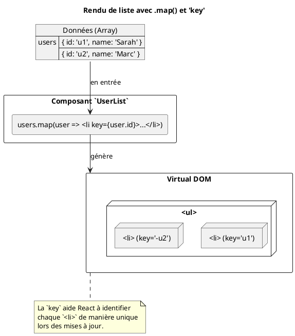

# Module 3 : Rendu Avancé et Optimisation de la Performance

Vous savez construire des composants solides. C'est parfait. Mais que se passe-t-il lorsque votre interface doit
s'adapter dynamiquement ? Afficher une liste de 1000 produits, un message d'erreur uniquement quand c'est nécessaire, ou
un formulaire complexe étape par étape ?

Dans ce module, nous allons apprendre à maîtriser l'art de l'affichage dynamique. Plus important encore, nous allons
découvrir les secrets pour que votre application ne ralentisse pas. C'est la différence entre une application qui "
fonctionne" et une application que les utilisateurs *adorent* utiliser.

## Objectifs Pédagogiques

À la fin de ce module, vous serez capable de :

* **Afficher** des composants de manière conditionnelle en utilisant différentes stratégies (ternaire, `&&`).
* **Générer** dynamiquement des listes d'éléments à partir de tableaux de données avec `.map()`.
* **Expliquer** le rôle crucial de la prop `key` et choisir des clés appropriées.
* **Structurer** votre JSX sans ajouter de nœuds inutiles au DOM grâce aux Fragments.
* **Optimiser** la performance de votre application en évitant les re-rendus inutiles avec `React.memo`, `useCallback`
  et `useMemo`.

## Pourquoi ce module est-il important ?

Imaginez que vous êtes le chef d'orchestre d'une grande symphonie. Au début, avec quelques musiciens (composants), il
est facile de tout diriger. Mais quand l'orchestre grandit, vous ne pouvez plus crier des instructions à tout le monde
en même temps. Vous devez donner des instructions précises : "Violons, jouez seulement à ce moment-là", "Trombones, ne
rejouez pas cette note si elle n'a pas changé".

Ce module vous apprend à devenir ce chef d'orchestre. Vous apprendrez à dire à React exactement quoi afficher, quand
l'afficher, et surtout, quand *ne pas* perdre de temps à redessiner quelque chose qui n'a pas changé. La maîtrise de ces
techniques est une étape décisive pour passer de développeur débutant à développeur confirmé.

## Compétences du Référentiel (REAC)

Ce module est au cœur du bloc **CCP-1 : Concevoir et développer des composants d'interface utilisateur**.

* **Maquetter une application :** Le rendu conditionnel et de liste sont les outils de base pour traduire une maquette
  dynamique en code.
* **Développer une interface utilisateur :** Les techniques abordées ici sont fondamentales pour toute interface
  non-triviale.
* **Développer des composants d’accès aux données :** Une fois les données récupérées, il faut les afficher
  efficacement, souvent sous forme de listes.
* **Préparer et tester un déploiement :** Les optimisations de performance sont une étape clé avant de mettre une
  application en production.

---

## 1. Le Rendu Conditionnel

L'une des tâches les plus courantes est d'afficher ou de masquer une partie de l'interface en fonction de l'état de
l'application. Faut-il afficher un message de chargement ? Un bouton "Se déconnecter" ? Ou un message d'erreur ?

<procedure title="L'analogie de l'assistant de navigation GPS">
<p>
Pensez à votre application GPS. Elle ne vous montre pas toutes les instructions en même temps. Elle suit une logique très stricte :
</p>
<ul>
    <li><b>SI</b> vous approchez d'un virage, <b>ALORS</b> affichez la flèche de direction.</li>
    <li><b>SI</b> vous êtes sur la bonne route, <b>ALORS</b> n'affichez rien de spécial, <b>SINON</b> affichez "Veuillez faire demi-tour".</li>
    <li><b>SI</b> un embouteillage est détecté <b>ET</b> qu'il est significatif, <b>ALORS</b> affichez une alerte.</li>
</ul>
<p>
Le rendu conditionnel en React, c'est exactement ça : appliquer des règles logiques pour décider quelles parties de l'interface (quels composants) doivent être rendues à un instant T.
</p>
</procedure>

React intègre cette logique directement dans le JSX grâce à des opérateurs JavaScript que vous connaissez déjà.

#### Avec l'opérateur ternaire `condition ? <A /> : <B />`

C'est la solution idéale pour un choix entre deux options : "soit ceci, soit cela".

```javascript
import React, {useState} from 'react';

function AuthButton() {
    const [isLoggedIn, setIsLoggedIn] = useState(false);

    return (
        <div>
            <p>
                {isLoggedIn ? 'Bienvenue !' : 'Veuillez vous connecter.'}
            </p>
            <button onClick={() => setIsLoggedIn(!isLoggedIn)}>
                {isLoggedIn ? 'Se déconnecter' : 'Se connecter'}
            </button>
        </div>
    );
}
```

#### Avec l'opérateur logique `&&`

Parfait pour le cas "affiche ceci, ou n'affiche rien". Si la condition est vraie, l'élément après `&&` est affiché. Si
elle est fausse, rien n'est affiché.

```javascript
import React from 'react';

function Mailbox({unreadMessages}) {
    const hasMessages = unreadMessages.length > 0;

    return (
        <div>
            <h1>Bonjour !</h1>
            {/* Si `hasMessages` est vrai, le h2 sera rendu. */}
            {hasMessages &&
                <h2>
                    Vous avez {unreadMessages.length} message(s) non lu(s).
                </h2>
            }
        </div>
    );
}
```

#### Avec un `if` classique

Pour une logique plus complexe, vous pouvez utiliser un `if` standard avant l'instruction `return` pour préparer le
contenu à afficher.

```javascript
import React from 'react';

function UserGreeting({status}) { // status peut être 'loading', 'error', 'success'
    let content;

    if (status === 'loading') {
        content = <p>Chargement en cours...</p>;
    } else if (status === 'error') {
        content = <p>Une erreur est survenue.</p>;
    } else {
        content = <p>Données chargées avec succès !</p>;
    }

    return <div>{content}</div>;
}
```

### Exercice 9 : Afficher une alerte

**Objectif :** Créer un composant `Alert` qui n'affiche un message que si une prop `message` lui est fournie.

1. Créez un composant `Alert`.
2. Il reçoit une prop `message` (une chaîne de caractères).
3. Utilisez l'opérateur `&&` pour que le composant n'affiche une `div` avec la classe `alert` et le contenu du message
   que si la prop `message` n'est ni nulle, ni vide.

#### Correction exercice 9 {collapsible="true"}

```javascript
import React from 'react';

// Supposons un CSS : .alert { padding: 10px; background-color: #f8d7da; }
function Alert({message}) {
    return (
        // Si `message` est une chaîne non vide (truthy),
        // React évaluera ce qui se trouve après le &&.
        // Si `message` est `null`, `undefined` ou '', l'expression s'arrête.
        <>
            {message && <div className="alert">{message}</div>}
        </>
    );
}

// Exemple d'utilisation dans un autre composant
// function App() {
//   const [error, setError] = useState('');
//   return (
//     <div>
//       <Alert message={error} />
//       <button onClick={() => setError('Le mot de passe est incorrect')}>
//         Simuler une erreur
//       </button>
//       <button onClick={() => setError('')}>
//         Effacer l'erreur
//       </button>
//     </div>
//   );
// }

export default Alert;
```

---

## 2. Afficher des Listes

Très rarement, vous afficherez des données une par une. Le plus souvent, vous recevrez un tableau de données (
utilisateurs, produits, articles) et vous devrez tous les afficher.

<procedure title="L'analogie de la chaîne de montage">
<p>
Imaginez une chaîne de montage automobile. Vous avez un conteneur rempli de châssis (votre tableau de données). Vous n'allez pas construire chaque voiture manuellement.
</p>
<p>
Vous définissez un "modèle" ou un "plan" (votre composant `CarItem`). Puis, vous utilisez une machine (la méthode `.map()` de JavaScript) qui prend chaque châssis, lui applique le plan, et place une voiture finie (un composant React rendu) sur la chaîne d'exposition (votre UI).
</p>
</procedure>

La méthode `.map()` des tableaux JavaScript est l'outil parfait pour cela. Elle transforme chaque élément d'un tableau
en un élément JSX.

```javascript
const numbers = [1, 2, 3, 4, 5];
const listItems = numbers.map((number) => <li>{number}</li>);

// Dans votre composant :
// <ul>{listItems}</ul>
```

#### L'attribut `key` : La carte d'identité de chaque élément

Quand vous faites cela, React a besoin d'une information cruciale : une **clé (`key`)**.

<warning title="La prop `key` est obligatoire pour les listes !">

<p>
La `key` est une prop spéciale que vous devez fournir pour chaque élément d'une liste. Elle doit être une <b>chaîne de caractères ou un nombre</b>, et elle doit être <b>unique et stable</b> parmi les éléments frères.
</p>
<p>
<b>Pourquoi ?</b> Reprenons l'analogie de la chaîne de montage. Si vous échangez deux voitures, comment React peut-il savoir qu'il s'agit des mêmes voitures mais dans un ordre différent, et non de deux nouvelles voitures ? La `key` est comme le numéro de série du véhicule. Elle permet à React de suivre chaque élément individuellement. Si vous ajoutez, supprimez ou réorganisez des éléments, React utilise la `key` pour savoir précisément quoi modifier dans le DOM, ce qui est beaucoup plus performant que de tout redessiner.
</p>
<p>
<b>Quelle clé choisir ?</b> Idéalement, un identifiant unique qui vient de vos données, comme `product.id`.
</p>
<div>
**Peut-on utiliser l'index du tableau ?** 

```javascript
monArray.map((item, index) => <li key={index}>...) 
```

C'est une très 
mauvaise pratique si la liste peut changer (ajout, suppression, réorganisation). Ne l'utilisez qu'en dernier recours pour des listes purement statiques.
</div>

</warning>

**Exemple concret :**

```javascript
import React from 'react';

const users = [
    {id: 'u1', name: 'Sarah'},
    {id: 'u2', name: 'Marc'},
    {id: 'u3', name: 'Léa'},
];

function UserList() {
    return (
        <ul>
            {users.map(user => (
                // `user.id` est une clé parfaite : unique et stable.
                <li key={user.id}>
                    {user.name}
                </li>
            ))}
        </ul>
    );
}
```



### Exercice 10 : Afficher une liste de produits

**Objectif :** Créer un composant qui affiche une liste de produits à partir d'un tableau.

1. Créez un composant `ProductList`.
2. À l'intérieur, définissez un tableau `products`. Chaque produit sera un objet avec `id`, `name` et `price`.
3. Utilisez `.map()` pour transformer ce tableau en une liste non ordonnée (`<ul>`).
4. Chaque élément de la liste (`<li>`) doit afficher le nom et le prix du produit.
5. Assurez-vous d'assigner une `key` correcte à chaque `<li>`.

#### Correction exercice 10 {collapsible="true"}

```javascript
import React from 'react';

const productsData = [
    {id: 'p-01', name: 'Écouteurs Bluetooth', price: 59.99},
    {id: 'p-02', name: 'Clavier Mécanique', price: 120.00},
    {id: 'p-03', name: 'Souris Gamer', price: 75.50},
];

function ProductList() {
    return (
        <div>
            <h2>Nos produits</h2>
            <ul>
                {productsData.map(product => (
                    <li key={product.id}>
                        {product.name} -
                        <strong>{product.price.toFixed(2)} €</strong>
                    </li>
                ))}
            </ul>
        </div>
    );
}

export default ProductList;
```

---

## 3. Les Fragments

Parfois, vous voulez retourner plusieurs éléments depuis un composant, mais la règle de React est stricte : un composant
ne peut retourner **qu'un seul élément racine**. La solution évidente est de tout envelopper dans une `<div>`.

<procedure title="L'analogie de l'emballage cadeau">

<p>
Vous avez deux cadeaux à offrir (un `h2` et un `p`). Pour les transporter, vous les mettez dans un grand sac (`div`). Problème : quand le destinataire ouvre le sac, il a un sac supplémentaire dont il ne sait que faire. Cette `div` inutile pollue votre structure HTML (le DOM), ce qui peut parfois casser vos styles CSS (par exemple avec Flexbox ou Grid) ou simplement rendre le code plus lourd.
</p>

<p>
Les <b>Fragments</b> sont la solution. C'est comme si vous utilisiez un simple ruban pour lier vos deux cadeaux. Ils sont groupés, mais sans emballage superflu. Le ruban disparaît à l'arrivée, et il ne reste que les cadeaux.
</p>
</procedure>

Un fragment vous permet de grouper une liste d'enfants sans ajouter de nœud supplémentaire au DOM.

Il existe deux syntaxes :

```javascript
import React, {Fragment} from 'react';

function MyComponent() {
    // Syntaxe longue (utile si vous avez besoin d'une `key`)
    return (
        <Fragment>
            <h2>Titre</h2>
            <p>Paragraphe</p>
        </Fragment>
    );
}

function AnotherComponent() {
    // Syntaxe courte (la plus courante)
    return (
        <>
            <td>Colonne 1</td>
            <td>Colonne 2</td>
        </>
    );
}
```

### Exercice 11 : Utiliser un Fragment

**Objectif :** Créer un composant qui retourne une série de termes de glossaire (`<dt>` et `<dd>`) qui doivent être des
enfants directs d'une liste de description (`<dl>`).

1. Imaginez un composant parent `Glossary` qui rend une balise `<dl>`.
2. Créez un composant enfant `GlossaryTerm`.
3. `GlossaryTerm` doit retourner un `<dt>` (terme) et un `<dd>` (définition) adjacents.
4. Utilisez un Fragment pour que ces deux éléments puissent être retournés ensemble sans être enveloppés dans une `div`
   invalide.

#### Correction exercice 11 {collapsible="true"}

```javascript
import React from 'react';

function GlossaryTerm() {
    // Sans Fragment, on serait obligé d'entourer ça d'une <div>,
    // ce qui est invalide à l'intérieur d'un <dl>.
    return (
        <>
            <dt>React</dt>
            <dd>Une bibliothèque JavaScript pour construire des interfaces utilisateur.</dd>

            <dt>Composant</dt>
            <dd>Un bloc de construction réutilisable qui retourne du JSX.</dd>
        </>
    );
}

function Glossary() {
    return (
        <dl>
            <GlossaryTerm/>
        </dl>
    );
}

export default Glossary;
```

---

## 4. Techniques d'Optimisation

Votre application grandit. Vous avez des listes, des conditions... et vous remarquez un léger ralentissement. Pourquoi ?
Souvent, c'est parce que React re-rend des composants qui n'ont pas besoin de l'être.

<procedure title="L'analogie de l'équipe de rénovation">
<p>
Imaginez que votre application est une maison en rénovation. Un changement d'état est un ordre de travail.
</p>

<p>
<b>Comportement par défaut de React :</b> L'ordre arrive : "Changer l'ampoule dans le salon". L'équipe de rénovation, très zélée, non seulement change l'ampoule, mais repeint aussi les murs du salon, vérifie la plomberie de la cuisine et tond la pelouse. C'est inutile et ça prend du temps. C'est ce qui se passe quand un composant parent se met à jour : par défaut, tous ses enfants sont re-rendus.
</p>

<div>
<b>Avec les optimisations :</b> Vous donnez des instructions plus intelligentes.
<ul>
    <li><b>`React.memo` :</b> "Peintre ! Ne repeins cette pièce que si la couleur demandée a changé. Sinon, ne touche à rien."</li>
    <li><b>`useCallback` :</b> "Électricien ! Je te donne le plan pour changer l'ampoule. C'est le même plan qu'hier. Ne le redessine pas à chaque fois."</li>
    <li><b>`useMemo` :</b> "Architecte ! Tu as calculé la surface du salon hier. Si les murs n'ont pas bougé, donne-moi le même chiffre, ne recalcule pas tout."</li>
</ul>
</div>
<p>
Ces outils permettent d'éviter le travail superflu, rendant la rénovation (votre application) beaucoup plus rapide.
</p>
</procedure>

#### `React.memo` : Mettre en cache un composant

`React.memo` est un "High-Order Component" (HOC). Il enveloppe votre composant et lui dit : "Ne te re-rends que si tes
`props` ont réellement changé".

```javascript
import React from 'react';

// Ce composant est "pur" : pour les mêmes props, il rend la même chose.
function UserAvatar({username}) {
    console.log(`Avatar de ${username} rendu.`);
    return <div>{/* ... image de l'avatar ... */}</div>;
}

// On exporte la version "mémoïsée".
export default React.memo(UserAvatar);
```

#### `useCallback` : Mémoriser une fonction

Problème : `React.memo` ne fonctionne pas bien si vous passez des fonctions en props. Pourquoi ? Parce qu'à chaque rendu
du parent, la fonction est recréée, donc sa référence change, et `React.memo` pense que la prop a changé. `useCallback`
résout ce problème en mémorisant la fonction elle-même.

```javascript
const handleSomething = useCallback(() => {
    // Fait quelque chose avec `data`.
}, [data]); // Ne recrée la fonction que si `data` change.

<MyMemoizedComponent onClick={handleSomething}/>
```

#### `useMemo` : Mémoriser une valeur calculée

Si vous avez un calcul coûteux qui est fait à chaque rendu, `useMemo` peut mettre en cache son résultat.

```javascript
// Imaginez que `filterAndSort` est une fonction très lente.
const visibleItems = useMemo(() => {
    return filterAndSort(allItems, filter);
}, [allItems, filter]); // Ne recalcule que si `allItems` ou `filter` change.
```

<warning title="N'optimisez pas prématurément !">
Ces outils sont puissants, mais ils ont un coût (en mémoire et en complexité). Ne les utilisez pas partout. La règle d'or :
1. Écrivez votre code de la manière la plus simple et lisible possible.
2. Si vous constatez un problème de performance (utilisez les React DevTools !), identifiez le goulot d'étranglement.
3. Appliquez ces optimisations de manière ciblée, là où elles sont nécessaires.
</warning>

### Exercice 12 : Optimiser un composant enfant

**Objectif :** Empêcher un composant "enfant" de se re-rendre inutilement.

1. Créez un composant parent `Dashboard` qui a un état `time` (qui se met à jour toutes les secondes avec `setInterval`)
   et un état `user`.
2. Créez un composant enfant `WelcomeMessage` qui prend `user` en prop et affiche "Bonjour, {user.name}".
3. Enveloppez `WelcomeMessage` avec `React.memo`.
4. Dans `Dashboard`, affichez l'heure et le `WelcomeMessage`.
5. Observez (avec un `console.log` dans `WelcomeMessage`) qu'il se re-rend à chaque seconde, même si `user` ne change
   pas.
6. *Bonus :* ajoutez un bouton dans `Dashboard` pour changer l'utilisateur. Constatez que `WelcomeMessage` se re-rend à
   ce moment-là, ce qui est le comportement attendu.

#### Correction exercice 12 {collapsible="true"}

```javascript
import React, {useState, useEffect} from 'react';

// 1. Composant enfant, rendu "coûteux" (simulé par un console.log)
const WelcomeMessage = React.memo(({user}) => {
    console.log(`Rendu du message pour ${user.name}...`);
    return <h1>Bonjour, {user.name} !</h1>;
});

// 2. Composant parent
function Dashboard() {
    const [time, setTime] = useState(new Date().toLocaleTimeString());
    const [user, setUser] = useState({name: 'Admin'});

    // Cet effet fait que le parent se re-rend toutes les secondes
    useEffect(() => {
        const timerId = setInterval(() => {
            setTime(new Date().toLocaleTimeString());
        }, 1000);
        return () => clearInterval(timerId);
    }, []);

    return (
        <div>
            <h2>Dashboard</h2>
            <p>Heure actuelle : {time}</p>
            <hr/>
            {/* 
        Même si le parent `Dashboard` se re-rend toutes les secondes,
        `React.memo` voit que la prop `user` n'a pas changé de référence.
        Il empêche donc `WelcomeMessage` de se re-rendre inutilement.
        Le console.log ne s'affichera qu'une seule fois au début,
        et si l'on clique sur le bouton.
      */}
            <WelcomeMessage user={user}/>
            <button onClick={() => setUser({name: 'Visiteur'})}>
                Changer d'utilisateur
            </button>
        </div>
    );
}

export default Dashboard;
```

---

## TP : Créer une TodoList filtrable et optimisée

Combinons tout cela pour créer une application de liste de tâches performante.

### Étape 1 : Structure de base

* Créez un composant `TodoApp`.
* Utilisez `useState` pour gérer une liste de tâches (`todos`). Chaque tâche est un objet `{ id, text, completed }`.
* Utilisez `useState` pour gérer un champ de saisie pour ajouter de nouvelles tâches.
* Affichez la liste des tâches en utilisant `.map()`. Chaque tâche sera rendue par un composant `TodoItem`. N'oubliez
  pas la `key` !

### Étape 2 : Ajouter les fonctionnalités

* Créez les fonctions pour :
    * Ajouter une tâche (`addTodo`).
    * Basculer l'état `completed` d'une tâche (`toggleTodo`).
    * Supprimer une tâche (`removeTodo`).
* Passez ces fonctions en props au composant `TodoItem`. `TodoItem` affichera le texte, une checkbox pour `toggleTodo`
  et un bouton pour `removeTodo`.

### Étape 3 : Ajouter les filtres

* Créez un état `filter` ('all', 'active', 'completed').
* Affichez des boutons pour changer ce filtre.
* Utilisez `useMemo` pour créer une variable `filteredTodos`. Ce calcul ne doit se refaire que si `todos` ou `filter`
  change.
* Affichez la liste `filteredTodos` au lieu de la liste `todos` complète.

### Étape 4 : Optimisation

* Enveloppez `TodoItem` dans `React.memo`.
* Observez (avec les React DevTools ou des `console.log`) que même avec `memo`, si vous cochez une case, tous les
  `TodoItem` se re-rendent. Pourquoi ? Parce que les fonctions `toggleTodo` et `removeTodo` sont recréées à chaque rendu
  de `TodoApp`.
* Utilisez `useCallback` sur `toggleTodo` et `removeTodo` pour mémoriser ces fonctions.
* Vérifiez à nouveau : maintenant, seul le `TodoItem` qui a été modifié devrait se re-rendre !

### Correction du TP {collapsible="true"}

<tabs>
<tab title="TodoItem.js">

```javascript
// src/components/TodoItem.js
import React from 'react';

// Enveloppé avec React.memo pour éviter les re-rendus inutiles.
const TodoItem = React.memo(({todo, toggleTodo, removeTodo}) => {
    console.log(`Rendu de TodoItem: ${todo.text}`);

    return (
        <li className={todo.completed ? 'completed' : ''}>
            <input
                type="checkbox"
                checked={todo.completed}
                onChange={() => toggleTodo(todo.id)}
            />
            <span>{todo.text}</span>
            <button onClick={() => removeTodo(todo.id)}>X</button>
        </li>
    );
});

export default TodoItem;
```

</tab>
<tab title="TodoApp.js">

```javascript
// src/App.js
import React, {useState, useCallback, useMemo} from 'react';
import TodoItem from './components/TodoItem';
import './App.css';

let nextId = 4;
const initialTodos = [
    {id: 1, text: 'Apprendre React', completed: true},
    {id: 2, text: 'Faire un TP', completed: false},
    {id: 3, text: 'Optimiser le code', completed: false},
];

function TodoApp() {
    const [todos, setTodos] = useState(initialTodos);
    const [text, setText] = useState('');
    const [filter, setFilter] = useState('all');

    const addTodo = (e) => {
        e.preventDefault();
        if (text.trim() === '') return;
        setTodos([...todos, {id: nextId++, text, completed: false}]);
        setText('');
    };

    // On utilise useCallback pour que les fonctions ne soient pas
    // recréées à chaque rendu, ce qui casserait l'optimisation de memo.
    const toggleTodo = useCallback((id) => {
        setTodos(
            todos.map(t => (t.id === id ? {...t, completed: !t.completed} : t))
        );
    }, [todos]); // La dépendance est `todos` car la fonction en dépend.

    const removeTodo = useCallback((id) => {
        setTodos(todos.filter(t => t.id !== id));
    }, [todos]);

    // On utilise useMemo pour éviter de recalculer la liste filtrée
    // si ni `todos` ni `filter` n'ont changé.
    const filteredTodos = useMemo(() => {
        console.log("Calcul de la liste filtrée...");
        switch (filter) {
            case 'active':
                return todos.filter(t => !t.completed);
            case 'completed':
                return todos.filter(t => t.completed);
            default:
                return todos;
        }
    }, [todos, filter]);

    return (
        <div className="todo-app">
            <h1>Ma TodoList</h1>
            <form onSubmit={addTodo}>
                <input
                    type="text"
                    value={text}
                    onChange={(e) => setText(e.target.value)}
                    placeholder="Ajouter une tâche..."
                />
                <button type="submit">Ajouter</button>
            </form>

            <div>
                <button onClick={() => setFilter('all')}>Tous</button>
                <button onClick={() => setFilter('active')}>Actifs</button>
                <button onClick={() => setFilter('completed')}>Terminés</button>
            </div>

            <ul>
                {filteredTodos.map(todo => (
                    <TodoItem
                        key={todo.id}
                        todo={todo}
                        toggleTodo={toggleTodo}
                        removeTodo={removeTodo}
                    />
                ))}
            </ul>
        </div>
    );
}

export default TodoApp;
```

</tab>
</tabs>

---

## Auto-évaluation

Testez vos connaissances ! Les réponses se trouvent à la toute fin du support de cours.

#### Questions à Choix Multiple (QCM)

**1. Vous voulez afficher un spinner de chargement si `isLoading` est vrai, et les données sinon. Quelle est la syntaxe
JSX la plus concise pour cela ?**

1. `<>{isLoading && <Spinner />} {!isLoading && <Data />}</>`
2. `{if (isLoading) { <Spinner /> } else { <Data /> }}`
3. `{isLoading ? <Spinner /> : <Data />}`
4. `{isLoading && <Spinner /> || <Data />}`

**2. Quand devriez-vous absolument éviter d'utiliser l'index d'un tableau comme `key` dans une liste ?**

1. Quand la liste est affichée dans un ordre alphabétique.
2. Quand la liste contient plus de 10 éléments.
3. Quand les éléments de la liste peuvent être ajoutés, supprimés ou réorganisés.
4. Il ne faut jamais utiliser l'index comme clé.

**3. Un composant `ListItem` enveloppé dans `React.memo` se re-rend inutilement. Vous lui passez une prop `onDelete` qui
est une fonction définie dans le composant parent. Quelle est la cause la plus probable ?**

1. `React.memo` ne fonctionne pas pour les composants qui ont des gestionnaires d'événements.
2. La fonction `onDelete` est redéclarée à chaque rendu du parent, changeant sa référence, ce qui annule l'effet de
   `memo`.
3. Le composant `ListItem` a son propre état interne qui change.
4. Il faut utiliser `useMemo` au lieu de `React.memo` pour les fonctions.

#### Questions Ouvertes

**4. Expliquez la différence de cas d'usage entre `useCallback` et `useMemo`. Donnez un exemple concret pour chacun.**

**5. Vous avez une liste d'utilisateurs que vous devez filtrer par leur nom (via un champ de recherche) PUIS trier par
ordre alphabétique. Expliquez comment vous utiliseriez `useMemo` pour optimiser cette opération.**

---

## Conclusion de ce module

Vous avez fait un grand pas en avant ! Vous ne vous contentez plus de simplement "afficher des choses", vous orchestrez
une interface dynamique et performante. Vous savez maintenant comment donner vie à vos données en les affichant sous
forme de listes, comment adapter votre UI à n'importe quelle situation avec le **rendu conditionnel**, et comment garder
une structure DOM propre avec les **Fragments**.

Plus important encore, vous avez été initié à l'art de l'optimisation. `React.memo`, `useCallback` et `useMemo` sont des
outils de précision qui, bien utilisés, feront de vos applications des expériences fluides et professionnelles.

Le prochain défi ? Gérer un état qui doit être partagé par de nombreux composants éloignés les uns des autres. Le "prop
drilling" et `useContext` ont leurs limites. Il est temps de découvrir les outils de **gestion d'état global** comme
Redux.

## Suggestions de projets pour pratiquer

1. **Niveau Débutant : Accordéon / FAQ**
    * **Description :** Créez une liste de questions. En cliquant sur une question, la réponse apparaît en dessous (et
      les autres se referment éventuellement).
    * **Piste technique :** Un état pour savoir quel item est actuellement ouvert (`useState(null)`). Utilisez le rendu
      conditionnel pour n'afficher la réponse que de l'item dont l'ID correspond à l'état.

2. **Niveau Intermédiaire : Galerie d'images filtrable**
    * **Description :** Affichez une grille d'images. Des boutons permettent de filtrer les images par catégorie (ex: "
      nature", "ville", "animaux").
    * **Piste technique :** Un état pour le filtre actif. Utilisez `.map()` pour afficher les images. `useMemo` est
      parfait pour calculer le tableau d'images filtrées.

3. **Niveau Avancé : Table de données triable et paginée**
    * **Description :** Affichez une grande quantité de données (100+ lignes) dans un tableau. Les en-têtes de colonnes
      sont cliquables pour trier les données. Des boutons "Précédent"/"Suivant" permettent de naviguer entre les pages.
    * **Piste technique :** C'est l'exercice parfait pour `useMemo`. Un `useMemo` calcule les données triées en fonction
      de l'état de tri. Un second `useMemo` (qui dépend du premier) calcule la "tranche" de données à afficher pour la
      page actuelle. `React.memo` sur les lignes du tableau (`<tr>`) est crucial pour la performance.