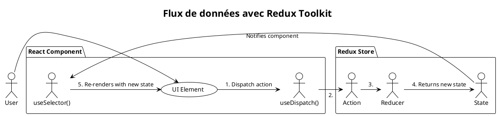

# Module 4 : Gestion de l'État Global

Vous avez découvert `useContext` comme un excellent moyen de faire passer des informations sans "prop drilling". C'est
parfait pour des données qui ne changent pas souvent, comme un thème ou les informations de l'utilisateur connecté. Mais
que se passe-t-il lorsque l'état devient plus complexe, que de nombreuses parties de votre application doivent le lire
*et* le modifier, et que les règles de modification deviennent très strictes ?

Ce module vous plonge dans les stratégies professionnelles de gestion d'état. Nous verrons comment structurer la logique
de votre application pour qu'elle soit prévisible, maintenable et facile à déboguer, même lorsqu'elle grandit de manière
exponentielle.

## Objectifs Pédagogiques

À la fin de ce module, vous serez capable de :

* **Expliquer** les limites de `useState` et `useContext` pour un état complexe.
* **Mettre en place** une gestion d'état local complexe avec le hook `useReducer`.
* **Comprendre** les principes fondamentaux de Redux (Source unique de vérité, état en lecture seule, modifications par
  des fonctions pures).
* **Implémenter** une gestion d'état globale moderne et efficace avec **Redux Toolkit**.
* **Utiliser** les hooks `useSelector` et `useDispatch` pour interagir avec le store Redux depuis vos composants.
* **Comparer** Redux avec d'autres philosophies de gestion d'état (Zustand, Jotai).

## Pourquoi ce module est-il important ?

Imaginez que vous construisez une ville. Au début, avec quelques maisons, chaque maison peut gérer sa propre
alimentation en eau (`useState`). Puis, pour un quartier, vous installez un puits partagé (`useContext`). Mais
maintenant, vous devez gérer l'eau pour toute la métropole ! Vous avez besoin d'une usine de traitement centrale, d'un
château d'eau principal, et d'un réseau de plomberie standardisé pour toute la ville. N'importe qui ne peut pas
simplement ouvrir une vanne principale ; il faut des procédures claires.

Les gestionnaires d'état globaux comme Redux sont cette usine de traitement de l'eau pour votre application. Ils
centralisent l'état (l'eau), fournissent des règles strictes pour le modifier (le traitement), et permettent à n'importe
quel composant (maison) de s'y brancher de manière fiable. Apprendre à utiliser ces outils, c'est apprendre à construire
des applications qui peuvent grandir sans sombrer dans le chaos.

## Compétences du Référentiel (REAC)

Ce module est crucial pour le développement d'applications complexes et s'inscrit dans le **CCP-1 : Concevoir et
développer des composants d'interface utilisateur**.

* **Maquetter une application :** La compréhension de la gestion d'état influence directement l'architecture des
  composants.
* **Développer une interface utilisateur de type desktop :** Les applications riches nécessitent presque toujours un
  gestionnaire d'état robuste.
* **Développer des composants d’accès aux données :** L'état global est souvent l'endroit où sont stockées les données
  récupérées depuis une API.

---

## 1. `useContext` + `useReducer` : Une alternative native

Avant de nous lancer dans une bibliothèque externe, explorons comment React nous permet de gérer un état complexe
nativement. Nous connaissons `useContext` pour diffuser la valeur. Mais que se passe-t-il si la logique pour *modifier*
cette valeur est complexe ? C'est là que `useReducer` entre en jeu.

<procedure title="L'analogie du tableau de commande">
<p>
Pensez à `useState` comme un simple interrupteur lumière (on/off, vrai/faux). C'est direct et simple.
</p>
<p>
Maintenant, imaginez que vous êtes aux commandes d'un robot complexe. Vous n'avez pas un seul interrupteur, mais un panneau de contrôle avec des boutons étiquetés : "Avancer", "Tourner à gauche", "Activer le bras". Vous n'indiquez pas directement les nouvelles coordonnées du robot ; vous lui donnez un <b>ordre</b> clair (une "action"). Le robot a une logique interne (un "reducer") qui interprète cet ordre et met à jour son propre état (sa position, l'état de son bras).
</p>
<p>
`useReducer` est ce tableau de commande. Il est idéal quand l'état suivant dépend du précédent et que la logique de mise à jour est complexe.
</p>
</procedure>

Le hook `useReducer` prend deux arguments principaux :

1. Une fonction **reducer** : `(state, action) => newState`.
2. Un **état initial**.

Il retourne un tableau contenant l'état actuel et une fonction `dispatch` pour envoyer des actions.

**Exemple : Un compteur avec `useReducer`**

```javascript
import React, {useReducer} from 'react';

// 1. L'état initial
const initialState = {count: 0};

// 2. La fonction reducer. Elle est "pure".
// Elle prend l'état actuel et une action, et retourne le NOUVEL état.
function reducer(state, action) {
    switch (action.type) {
        case 'increment':
            return {count: state.count + 1};
        case 'decrement':
            return {count: state.count - 1};
        case 'reset':
            return {count: action.payload};
        default:
            throw new Error();
    }
}

function CounterWithReducer() {
    // 3. On initialise le hook
    const [state, dispatch] = useReducer(reducer, initialState);

    return (
        <>
            Compteur : {state.count}
            {/* 4. On "dispatche" des actions pour demander un changement d'état */}
            <button onClick={() => dispatch({type: 'increment'})}>+</button>
            <button onClick={() => dispatch({type: 'decrement'})}>-</button>
            <button onClick={() => dispatch({type: 'reset', payload: 0})}>
                Réinitialiser
            </button>
        </>
    );
}
```

En combinant `useReducer` pour la logique et `useContext` pour la diffusion, on obtient une solution de gestion d'état
native et puissante. Le `Provider` du contexte peut alors fournir à la fois `state` et `dispatch` à tous les composants
enfants.

### Exercice 13 : Panier simple avec `useReducer` et `useContext`

**Objectif :** Créer un mini-panier d'achats où plusieurs composants peuvent ajouter des articles.

1. Définissez un `reducer` qui peut gérer deux types d'actions : `ADD_ITEM` et `REMOVE_ITEM`. L'état sera un objet avec
   une propriété `items` (un tableau).
2. Créez un `CartContext`.
3. Dans `App.js`, utilisez `useReducer` pour créer `state` et `dispatch`. Fournissez-les via le `CartContext.Provider`.
4. Créez un composant `ProductItem` qui utilise `useContext` pour récupérer `dispatch` et qui, au clic sur un bouton,
   dispatche une action `ADD_ITEM`.
5. Créez un composant `CartDisplay` qui utilise `useContext` pour récupérer `state` et affiche le nombre d'articles dans
   le panier.

#### Correction exercice 13 {collapsible="true"}

<tabs>
<tab title="CartContext.js">
```javascript
// src/contexts/CartContext.js
import { createContext } from 'react';

export const CartContext = createContext(null);

```
</tab>
<tab title="App.js (Provider & Reducer)">
```javascript
// src/App.js
import React, { useReducer } from 'react';
import { CartContext } from './contexts/CartContext';
import ProductItem from './components/ProductItem';
import CartDisplay from './components/CartDisplay';

const initialState = {
  items: [],
};

function cartReducer(state, action) {
  switch (action.type) {
    case 'ADD_ITEM':
      // Ajoute le produit (payload) au tableau d'items
      return {
        ...state,
        items: [...state.items, action.payload],
      };
    case 'REMOVE_ITEM':
      // Filtre pour enlever le produit avec l'ID correspondant
      return {
        ...state,
        items: state.items.filter(item => item.id !== action.payload.id),
      };
    default:
      return state;
  }
}

function App() {
  const [state, dispatch] = useReducer(cartReducer, initialState);

  return (
    <CartContext.Provider value={{ state, dispatch }}>
      <div className="App">
        <h1>Boutique</h1>
        <CartDisplay />
        <ProductItem product={{ id: 1, name: 'Livre React' }} />
        <ProductItem product={{ id: 2, name: 'T-shirt Hooks' }} />
      </div>
    </CartContext.Provider>
  );
}

export default App;
```

</tab>
<tab title="ProductItem.js (Consumer)">

```javascript
// src/components/ProductItem.js
import React, { useContext } from 'react';
import { CartContext } from '../contexts/CartContext';

function ProductItem({ product }) {
const { dispatch } = useContext(CartContext);

const handleAddToCart = () => {
dispatch({ type: 'ADD_ITEM', payload: product });
};

return (
<div>
<p>{product.name}</p>
<button onClick={handleAddToCart}>Ajouter au panier</button>
</div>
);
}

export default ProductItem;

```
</tab>
<tab title="CartDisplay.js (Consumer)">

```javascript
// src/components/CartDisplay.js
import React, { useContext } from 'react';
import { CartContext } from '../contexts/CartContext';

function CartDisplay() {
  const { state } = useContext(CartContext);

  return (
    <h2>
      Panier : {state.items.length} article(s)
    </h2>
  );
}

export default CartDisplay;
```

</tab>
</tabs>

---

## 2. Introduction à Redux

La solution `useReducer` + `useContext` est excellente, mais pour les très grandes applications, elle peut devenir
limitée. On peut se retrouver à écrire beaucoup de code répétitif, et elle n'offre pas d'outils avancés comme les "
middlewares" (pour gérer les appels API, par exemple) ou les extraordinaires outils de débogage de Redux (comme le "
time-travel debugging").

<procedure title="L'analogie de la comptabilité d'entreprise">
<p>
Gérer l'état de son budget personnel (`useState`) est simple. Gérer celui d'une petite association (`useReducer` + `useContext`) est faisable avec un tableur.
</p>
<p>
Mais pour gérer la comptabilité d'une multinationale, vous avez besoin de plus. Vous avez besoin d'un système comptable professionnel (<b>Redux</b>). Ce système repose sur des principes très stricts pour garantir qu'aucune transaction n'est perdue et que tout est auditable.
</p>
</procedure>

#### Les 3 principes de Redux

1. **Source unique de vérité :** Tout l'état de votre application est stocké dans un seul objet, appelé le **Store**. (
   Un seul grand livre de comptes pour toute l'entreprise).
2. **L'état est en lecture seule :** Le seul moyen de modifier l'état est d'émettre une **action**, un objet décrivant
   ce qui s'est passé. (On ne modifie jamais une ligne du grand livre. On crée une nouvelle entrée : "Virement de X à
   Y").
3. **Les modifications sont effectuées avec des fonctions pures :** Pour spécifier comment l'état est transformé par les
   actions, vous écrivez des fonctions pures appelées des **reducers**. (Un comptable qui prend le livre actuel et une
   transaction, et produit une nouvelle version du livre sans effet de bord).

#### Redux Toolkit (RTK) : La manière moderne d'utiliser Redux

Historiquement, Redux demandait beaucoup de code de configuration ("boilerplate"). **Redux Toolkit (RTK)** est
aujourd'hui la méthode officielle et recommandée. Elle simplifie tout et inclut les meilleures pratiques par défaut.

Les concepts clés de RTK :

* **`configureStore`**: Crée le store Redux avec une configuration simplifiée.
* **`createSlice`**: Le cœur de RTK. Une fonction qui accepte un état initial et un objet de fonctions "reducers", et
  qui génère automatiquement les actions et le reducer principal pour cette partie de l'état.
* **`useDispatch`**: Un hook pour obtenir la fonction `dispatch` et envoyer des actions.
* **`useSelector`**: Un hook pour extraire des données du store et s'abonner aux mises à jour.



**Exemple concret : Un compteur avec Redux Toolkit**

<tabs>
<tab title="features/counter/counterSlice.js">
```javascript
import { createSlice } from '@reduxjs/toolkit';

const initialState = {
value: 0,
};

export const counterSlice = createSlice({
name: 'counter', // Nom du "slice"
initialState,
// Le reducer est un objet de fonctions.
// RTK utilise Immer.js, qui permet d'écrire du code "mutant"
// de manière sécurisée.
reducers: {
increment: (state) => {
state.value += 1;
},
decrement: (state) => {
state.value -= 1;
},
},
});

// RTK génère automatiquement les "action creators" pour nous
export const { increment, decrement } = counterSlice.actions;

// On exporte le reducer généré
export default counterSlice.reducer;

```
</tab>
<tab title="app/store.js">
```javascript
import { configureStore } from '@reduxjs/toolkit';
import counterReducer from '../features/counter/counterSlice';

export const store = configureStore({
  // On connecte nos slices au store
  reducer: {
    counter: counterReducer,
    // on pourra ajouter d'autres reducers ici : user, cart, etc.
  },
});
```

</tab>
<tab title="Counter.js (Composant)">

```javascript
import React from 'react';
import { useSelector, useDispatch } from 'react-redux';
import { increment, decrement } from './features/counter/counterSlice';

export function Counter() {
// `useSelector` pour lire une valeur du store.
// Le composant se re-rendra automatiquement si cette valeur change.
const count = useSelector((state) => state.counter.value);

// `useDispatch` pour pouvoir envoyer des actions.
const dispatch = useDispatch();

return (
<div>
<div>
<button aria-label="Increment value" onClick={() => dispatch(increment())}>
+
</button>
<span>{count}</span>
<button aria-label="Decrement value" onClick={() => dispatch(decrement())}>
-
</button>
</div>
</div>
);
}
```
</tab>
<tab title="index.js (Intégration)">

```javascript
// On enveloppe notre App avec le Provider de Redux
// pour rendre le store accessible partout.
import { Provider } from 'react-redux';
import { store } from './app/store';

root.render(
  <Provider store={store}>
    <App />
  </Provider>
);
```
</tab>
</tabs>

### Exercice 14 : Gérer le thème de l'application avec RTK

**Objectif :** Créer un slice pour gérer le thème (clair/sombre) de l'application.

1. Créez un `themeSlice.js`.
2. L'état initial sera `{ value: 'light' }`.
3. Créez un reducer `toggleTheme` qui change la valeur de 'light' à 'dark' et vice-versa.
4. Connectez ce slice à votre store.
5. Créez un composant `ThemeSwitcher` qui utilise `useDispatch` pour appeler `toggleTheme` au clic sur un bouton.
6. Dans `App.js`, utilisez `useSelector` pour récupérer le thème actuel et appliquez une classe CSS correspondante à la
   div principale.

#### Correction exercice 14 {collapsible="true"}

<tabs>
<tab title="features/theme/themeSlice.js">
```javascript
import { createSlice } from '@reduxjs/toolkit';

const initialState = {
mode: 'light',
};

export const themeSlice = createSlice({
name: 'theme',
initialState,
reducers: {
toggleTheme: (state) => {
state.mode = state.mode === 'light' ? 'dark' : 'light';
},
},
});

export const { toggleTheme } = themeSlice.actions;

export default themeSlice.reducer;

```
</tab>
<tab title="app/store.js">
```javascript
import { configureStore } from '@reduxjs/toolkit';
import counterReducer from '../features/counter/counterSlice';
import themeReducer from '../features/theme/themeSlice'; // Importez le nouveau reducer

export const store = configureStore({
  reducer: {
    counter: counterReducer,
    theme: themeReducer, // Ajoutez-le ici
  },
});
```

</tab>
<tab title="ThemeSwitcher.js">

```javascript
import React from 'react';
import { useDispatch, useSelector } from 'react-redux';
import { toggleTheme } from '../features/theme/themeSlice';

function ThemeSwitcher() {
const theme = useSelector((state) => state.theme.mode);
const dispatch = useDispatch();

return (
<button onClick={() => dispatch(toggleTheme())}>
Passer au thème {theme === 'light' ? 'sombre' : 'clair'}
</button>
);
}

export default ThemeSwitcher;

```
</tab>
<tab title="App.js">

```javascript
import React from 'react';
import { useSelector } from 'react-redux';
import ThemeSwitcher from './components/ThemeSwitcher';
import './App.css';

function App() {
  const theme = useSelector((state) => state.theme.mode);

  return (
    // La classe CSS de la div change en fonction de l'état Redux
    <div className={`App ${theme}`}>
      <h1>Mon App avec Redux</h1>
      <ThemeSwitcher />
    </div>
  );
}

export default App;
```

</tab>
</tabs>

---

## 3. Alternatives à Redux

Redux est un standard de l'industrie, mais il n'est pas la seule solution. Pour des projets moins complexes, des
alternatives plus légères ont gagné en popularité. Il est bon de les connaître.

<procedure title="L'analogie du transport">
<p>
Redux est comme un <b>train de marchandises</b>. Il est incroyablement puissant, robuste, peut transporter une charge énorme sur de longues distances et suit des rails très stricts. Parfait pour la logistique industrielle. Mais si vous voulez juste transporter une pizza, prendre le train est un peu excessif.
</p>

<div>
<ul>
    <li><b>Zustand</b> est comme un <b>scooter de livraison</b>. Ultra-léger, rapide, simple à utiliser, très peu de règles. Vous lui donnez l'adresse, et il y va. Parfait pour les besoins rapides et locaux.</li>
    <li><b>Jotai</b> est comme un <b>réseau de drones</b>. Chaque drone transporte un seul petit paquet (un "atome" d'état). C'est très granulaire et efficace, car seul le drone concerné bouge, les autres restent immobiles.</li>
</ul>
</div>

<p>
Chaque outil a sa place. Pour des applications d'entreprise complexes, Redux reste souvent le roi. Pour des projets plus petits ou des besoins spécifiques, les alternatives peuvent être plus productives.
</p>
</procedure>

---

## TP : Un panier d'achat complet avec Redux Toolkit

Mettons en pratique la puissance de RTK pour créer un panier d'achat fonctionnel.

### Étape 1 : Créer le `cartSlice`

* L'état initial doit être un tableau vide `items: []`.
* Créez un reducer `addItem(state, action)`. `action.payload` sera un objet produit (`{ id, name, price }`). Si le
  produit est déjà dans le panier, incrémentez sa `quantity`. Sinon, ajoutez-le avec `quantity: 1`.
* Créez un reducer `removeItem(state, action)`. `action.payload` sera l'ID du produit à retirer.
* Créez un reducer `updateQuantity(state, action)`. `action.payload` sera `{ id, quantity }`.

### Étape 2 : Créer les "Selectors"

* Les selectors sont des fonctions qui extraient et calculent des données dérivées du store. Dans `cartSlice.js`,
  exportez deux selectors :
    * `selectCartItems` qui retourne `state.cart.items`.
    * `selectCartTotal` qui utilise `reselect` (souvent inclus ou ajouté) ou un simple `.reduce()` pour calculer le prix
      total du panier.

### Étape 3 : Créer les composants

* `ProductList.js` : Affiche une liste de produits. Chaque produit a un bouton "Ajouter au panier" qui `dispatch`
  l'action `addItem`.
* `ShoppingCart.js` :
    * Utilise `useSelector` avec `selectCartItems` pour afficher la liste des articles dans le panier.
    * Pour chaque article, affichez son nom, prix, quantité, et un bouton pour le supprimer (`removeItem`).
    * Affichez le total calculé avec `selectCartTotal`.
* `Header.js` : Affiche une icône de panier avec le nombre total d'articles (la longueur du tableau `items`).

### Correction du TP {collapsible="true"}

<tabs>
<tab title="features/cart/cartSlice.js">

```javascript
import { createSlice, createSelector } from '@reduxjs/toolkit';

const initialState = {
items: [],
};

const cartSlice = createSlice({
name: 'cart',
initialState,
reducers: {
addItem: (state, action) => {
const item = state.items.find(i => i.id === action.payload.id);
if (item) {
item.quantity++;
} else {
state.items.push({ ...action.payload, quantity: 1 });
}
},
removeItem: (state, action) => {
state.items = state.items.filter(i => i.id !== action.payload);
},
updateQuantity: (state, action) => {
const item = state.items.find(i => i.id === action.payload.id);
if (item) {
item.quantity = action.payload.quantity;
}
},
},
});

export const { addItem, removeItem, updateQuantity } = cartSlice.actions;

// Selectors
export const selectCartItems = (state) => state.cart.items;

export const selectCartTotal = createSelector(
selectCartItems,
(items) => items.reduce((total, item) =>
total + item.price * item.quantity, 0)
);

export default cartSlice.reducer;

```
</tab>
<tab title="ProductList.js">

```javascript
import React from 'react';
import { useDispatch } from 'react-redux';
import { addItem } from '../features/cart/cartSlice';

const products = [
  { id: 1, name: 'Laptop', price: 1200 },
  { id: 2, name: 'Keyboard', price: 100 },
  { id: 3, name: 'Mouse', price: 50 },
];

function ProductList() {
  const dispatch = useDispatch();

  return (
    <div>
      <h2>Produits</h2>
      {products.map(product => (
        <div key={product.id}>
          <span>{product.name} - {product.price}€</span>
          <button onClick={() => dispatch(addItem(product))}>
            Ajouter
          </button>
        </div>
      ))}
    </div>
  );
}
export default ProductList;
```

</tab>
<tab title="ShoppingCart.js">

```javascript
import React from 'react';
import { useSelector, useDispatch } from 'react-redux';
import {
  removeItem,
  selectCartItems,
  selectCartTotal,
} from '../features/cart/cartSlice';

function ShoppingCart() {
const cartItems = useSelector(selectCartItems);
const cartTotal = useSelector(selectCartTotal);
const dispatch = useDispatch();

return (
<div>
<h2>Panier</h2>
{cartItems.length === 0 ? (
<p>Votre panier est vide.</p>
) : (
<ul>
{cartItems.map(item => (
<li key={item.id}>
{item.name} (x{item.quantity}) - {item.price * item.quantity}€
<button onClick={() => dispatch(removeItem(item.id))}>
Supprimer
</button>
</li>
))}
</ul>
)}
<h3>Total : {cartTotal.toFixed(2)}€</h3>
</div>
);
}
export default ShoppingCart;
```
</tab>
</tabs>

---

## Auto-évaluation

Testez vos connaissances ! Les réponses se trouvent à la toute fin du support de cours.

#### Questions à Choix Multiple (QCM)

**1. Quel est le rôle d'un "reducer" dans Redux ?**

1. D'interroger une API pour obtenir de nouvelles données.
2. De décrire une intention de changer l'état.
3. De prendre l'état actuel et une action, et de retourner le nouvel état.
4. De connecter le store Redux aux composants React.

**2. Qu'est-ce que Redux Toolkit `createSlice` génère automatiquement pour vous ?**

1. Uniquement le reducer.
2. Uniquement les action creators.
3. Le reducer, les action creators, et les types d'action.
4. Le composant React pour afficher les données.

**3. Comment un composant React lit-il une donnée depuis le store Redux ?**

1. En appelant `store.getState()` directement dans le JSX.
2. En utilisant le hook `useDispatch`.
3. En utilisant le hook `useSelector`.
4. En important l'état comme une prop depuis le composant parent.

#### Questions Ouvertes

**4. Expliquez le principe de la "source unique de vérité" et pourquoi c'est un avantage majeur dans une grande
application.**

**5. Vous avez une application où l'état est très simple (un booléen pour un thème) et partagé entre de nombreux
composants. Quelle solution choisiriez-vous entre `useContext` et Redux, et pourquoi ?**

---

## Conclusion de ce module

Vous avez maintenant les clés pour architecturer des applications React complexes et scalables. Vous avez compris que la
gestion de l'état n'est pas juste une question technique, mais une question de **prévisibilité** et de **maintenabilité
**.

Vous avez vu comment passer de solutions natives comme `useReducer` et `useContext` à une solution de calibre industriel
comme **Redux Toolkit**. Vous savez maintenant comment centraliser votre logique métier dans des **slices**, comment
interagir avec le **store** de manière découplée grâce à `useSelector` et `useDispatch`, et comment tout cela forme un
flux de données unidirectionnel clair et facile à déboguer.

Maintenant que nous savons gérer l'état de notre application de manière robuste, d'où vient cet état ? La plupart du
temps, d'un serveur externe. Le prochain module est donc une suite logique : nous allons apprendre à **communiquer avec
des APIs** pour remplir notre application de données dynamiques et réelles.

## Suggestions de projets pour pratiquer

1. **Niveau Débutant : Application de notes simple**
    * **Description :** Une application où l'on peut ajouter, éditer et supprimer des notes. Une note a un titre et un
      contenu.
    * **Piste technique :** Créez un `notesSlice` avec des reducers pour `addNote`, `updateNote`, `deleteNote`. L'état
      sera un tableau d'objets `notes`.

2. **Niveau Intermédiaire : Quiz interactif**
    * **Description :** Un quiz multi-questions. L'application doit suivre la question actuelle, les réponses de
      l'utilisateur et le score final.
    * **Piste technique :** Un `quizSlice`. L'état pourrait inclure `questions: []`, `currentQuestionIndex: 0`,
      `answers: {}`, `status: 'playing' | 'finished'`. Les reducers seraient `answerQuestion` (qui enregistre la réponse
      et passe à la question suivante) et `restartQuiz`.

3. **Niveau Avancé : Clone de Trello (simplifié)**
    * **Description :** Un tableau avec plusieurs colonnes ("À faire", "En cours", "Terminé"). L'utilisateur peut
      ajouter des cartes à une colonne et les glisser-déposer d'une colonne à l'autre.
    * **Piste technique :** C'est un excellent cas d'usage pour Redux. L'état pourrait être
      `{ columns: { 'col-1': { id: 'col-1', title: 'À faire', cardIds: [] } }, cards: { 'card-1': { ... } } }`. Le
      drag-and-drop est un défi en soi (une bibliothèque comme `react-beautiful-dnd` peut aider), et les actions Redux (
      `moveCardToColumn`, `reorderCardInColumn`) rendront la logique de mise à jour de l'état très propre.