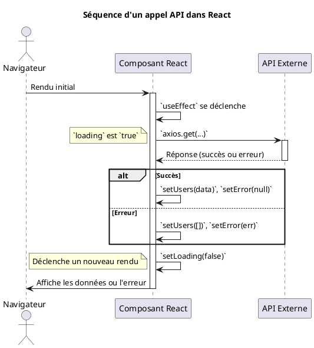

# Module 5 : Communication avec les APIs

Jusqu'à présent, nos applications vivaient dans une bulle. Les données que nous manipulions étaient "en dur" dans notre
code. C'est parfait pour apprendre, mais les applications réelles sont vivantes : elles affichent des informations à
jour, permettent aux utilisateurs de sauvegarder leur travail, et interagissent avec d'autres services. Tout cela se
fait via des **APIs** (Application Programming Interfaces).

Ce module vous apprendra à transformer votre application en un client intelligent capable de dialoguer avec des serveurs
distants pour récupérer et envoyer des données.

## Objectifs Pédagogiques

À la fin de ce module, vous serez capable de :

* **Rappeler** le fonctionnement de la communication asynchrone en JavaScript avec les `Promises` et `async/await`.
* **Effectuer** des requêtes HTTP pour récupérer des données en utilisant l'API `fetch` native et la bibliothèque
  `Axios`.
* **Comparer** les avantages et inconvénients de `fetch` et `Axios`.
* **Intégrer** proprement les appels API dans le cycle de vie de vos composants React avec `useEffect`.
* **Gérer** les différents états d'une requête réseau (`loading`, `data`, `error`) pour une meilleure expérience
  utilisateur.
* **Créer** un hook personnalisé réutilisable (`useFetch`) pour simplifier votre logique d'accès aux données.

## Pourquoi ce module est-il important ?

Imaginez que vous avez construit la plus belle cuisine de restaurant du monde (`votre application React`). Elle est
propre, organisée, et vos cuisiniers (`vos composants`) sont prêts à travailler. Mais... les garde-mangers sont vides.
Sans ingrédients frais (`données externes`), vous ne pouvez préparer que des plats imaginaires.

Ce module vous apprend à devenir le responsable des approvisionnements. Vous allez apprendre à passer des commandes (
`requêtes API`) auprès de vos fournisseurs (`serveurs`), à gérer la livraison (`réponse de l'API`), à vérifier la
qualité des produits (`gestion des erreurs`), et à stocker les ingrédients dans votre cuisine (`mise à jour de l'état`)
pour que vos cuisiniers puissent enfin préparer de vrais plats pour vos clients. Sans cette compétence, votre
application restera une simple maquette.

## Compétences du Référentiel (REAC)

Ce module est la concrétisation de la compétence **Développer des composants d’accès aux données** du bloc **CCP-1**.

* **Développer des composants d’accès aux données :** Nous allons implémenter la logique complète pour consommer des
  points de terminaison d'API REST.
* **Maquetter une application :** La structure de vos composants dépendra souvent de la forme des données retournées par
  les APIs.
* **Développer une interface utilisateur :** L'interface devra réagir aux états de chargement et d'erreur des requêtes,
  ce qui est un aspect clé de l'UX moderne.

---

## 1. Promises et `async/await` : Un rappel essentiel

La communication avec un serveur n'est pas instantanée. C'est **asynchrone**. JavaScript a besoin d'un moyen de gérer
ces opérations qui prennent du temps sans bloquer le reste de l'application.

<procedure title="L'analogie de la commande au restaurant">
<p>
Quand vous commandez un plat, vous ne restez pas planté devant le comptoir à attendre. Le serveur vous donne un ticket (une <b>Promesse</b>). Cette promesse dit : "Je m'occupe de votre plat. Je vous préviendrai quand il sera prêt (<b>résolue</b>) ou s'il y a un problème en cuisine (<b>rejetée</b>)."
</p>
<p>
Pendant ce temps, vous pouvez faire autre chose (le reste de votre code continue de s'exécuter).
</p>
<ul>
    <li>La syntaxe <code>.then()</code>, c'est comme dire : "Quand le plat sera prêt, voici ce que je ferai avec."</li>
    <li>La syntaxe <code>async/await</code>, c'est une manière plus moderne et lisible de faire la même chose. C'est comme si vous disiez à un ami : "<b>Attends</b> (await) que le plat arrive, puis nous mangerons." C'est plus naturel à lire.</li>
</ul>
</procedure>

`async/await` est du "sucre syntaxique" au-dessus des Promesses, rendant le code beaucoup plus lisible. Nous
l'utiliserons principalement.

```javascript
// Avec .then()
function getUserWithThen() {
    fetch('https://api.example.com/user/1')
        .then(response => response.json())
        .then(data => console.log(data))
        .catch(error => console.error('Erreur !', error));
}

// Avec async/await (plus lisible)
async function getUserWithAsyncAwait() {
    try {
        const response = await fetch('https://api.example.com/user/1');
        const data = await response.json();
        console.log(data);
    } catch (error) {
        console.error('Erreur !', error);
    }
}
```

---

## 2. Appels HTTP : `fetch` vs `Axios`

Pour faire des requêtes, nous avons deux outils principaux : l'API `fetch` intégrée au navigateur, et `Axios`, une
bibliothèque très populaire.

<procedure title="L'analogie du kit de voyage">
<p>
Imaginez que vous préparez un voyage.
</p>
<p>
<b>`fetch`</b> est le kit de base : il vous donne un billet d'avion et un passeport. C'est tout ce dont vous avez besoin pour voyager, mais c'est à vous de gérer les détails : convertir vos devises (transformer la réponse en JSON avec <code>.json()</code>), vérifier si l'hôtel est bien ouvert (vérifier que la réponse HTTP est un succès avec <code>response.ok</code>), etc. C'est minimaliste et déjà inclus.
</p>
<p>
<b>`Axios`</b> est le forfait "tout compris". Il s'occupe de tout pour vous : les devises sont déjà converties (les données sont directement en JSON dans <code>response.data</code>), et si l'hôtel est fermé (une erreur HTTP comme 404 ou 500), l'agence annule le voyage et vous prévient directement (il rejette la promesse, ce qui est capturé par le <code>catch</code>). C'est plus confortable et demande moins de configuration.
</p>
</procedure>

<tabs>
<tab title="Avec Fetch API (natif)">

```javascript
async function getPostsWithFetch() {
  try {
    const response = await fetch('https://jsonplaceholder.typicode.com/posts');

    // fetch ne considère pas les erreurs 4xx/5xx comme des erreurs.
    // Il faut vérifier manuellement le statut de la réponse.
    if (!response.ok) {
      throw new Error(`Erreur HTTP : ${response.status}`);
    }
    
    // Il faut manuellement transformer la réponse en JSON.
    const data = await response.json();
    console.log(data);

} catch (error) {
console.error("Impossible de récupérer les articles:", error);
}
}

```
</tab>
<tab title="Avec Axios (librairie)">

```javascript
// D'abord, installer Axios : npm install axios
import axios from 'axios';

async function getPostsWithAxios() {
  try {
    // Axios gère les erreurs HTTP et la conversion JSON automatiquement.
    const response = await axios.get(
      'https://jsonplaceholder.typicode.com/posts'
    );
    
    // Les données sont directement dans `response.data`.
    console.log(response.data);
  } catch (error) {
    // Le bloc `catch` sera exécuté pour les erreurs réseau ET les erreurs HTTP.
    console.error("Impossible de récupérer les articles:", error);
  }
}
```

</tab>
</tabs>

| Caractéristique          | Fetch API                          | Axios                                             |
|:-------------------------|:-----------------------------------|:--------------------------------------------------|
| **Inclus**               | ✅ Natif dans le navigateur         | ❌ Nécessite une installation                      |
| **Conversion JSON**      | Manuelle (`response.json()`)       | ✅ Automatique                                     |
| **Gestion erreurs HTTP** | Manuelle (`response.ok`)           | ✅ Automatique (via `catch`)                       |
| **Fonctionnalités+**     | Basique                            | Intercepteurs, annulation...                      |
| **Verdict**              | Très bien pour les besoins simples | Recommandé pour les applications professionnelles |

---

## 3. Intégration dans React

Nous savons *comment* faire un appel API, mais **où** et **quand** le faire dans un composant React ?

La réponse est : dans un hook `useEffect`, pour traiter l'appel comme un **effet de bord**. Et pour l'expérience
utilisateur, nous devons gérer 3 états :

1. **`loading`** : La requête est en cours. On affiche un spinner.
2. **`data`** : La requête a réussi. On affiche les données.
3. **`error`** : La requête a échoué. On affiche un message d'erreur.

**Exemple concret : Afficher une liste d'utilisateurs**

```javascript
import React, {useState, useEffect} from 'react';
import axios from 'axios';

function UserListFromApi() {
    // 1. Déclarer les 3 états
    const [users, setUsers] = useState([]);
    const [loading, setLoading] = useState(true);
    const [error, setError] = useState(null);

    // 2. Lancer l'effet au montage du composant
    useEffect(() => {
        const fetchUsers = async () => {
            try {
                const response = await axios.get(
                    'https://jsonplaceholder.typicode.com/users'
                );
                setUsers(response.data);
            } catch (err) {
                setError(err);
            } finally {
                // Dans tous les cas, le chargement est terminé.
                setLoading(false);
            }
        };

        fetchUsers();
    }, []); // Le tableau vide `[]` assure que l'effet ne s'exécute qu'une fois.

    // 3. Gérer l'affichage en fonction des états
    if (loading) return <p>Chargement en cours...</p>;
    if (error) return <p>Erreur de chargement: {error.message}</p>;

    return (
        <div>
            <h1>Liste des utilisateurs</h1>
            <ul>
                {users.map(user => (
                    <li key={user.id}>{user.name}</li>
                ))}
            </ul>
        </div>
    );
}
```



---

## 4. (Bonus) Hooks personnalisés : Créer un `useFetch` réutilisable

Vous avez remarqué que la logique `loading`/`data`/`error` va se répéter partout où vous ferez un appel API ? C'est le
moment idéal pour créer un **hook personnalisé** et respecter le principe DRY (Don't Repeat Yourself).

Un hook personnalisé est une fonction JavaScript dont le nom commence par `use` et qui peut appeler d'autres hooks.

```javascript
// src/hooks/useFetch.js
import {useState, useEffect} from 'react';
import axios from 'axios';

function useFetch(url) {
    const [data, setData] = useState(null);
    const [loading, setLoading] = useState(true);
    const [error, setError] = useState(null);

    useEffect(() => {
        const fetchData = async () => {
            setLoading(true);
            try {
                const response = await axios.get(url);
                setData(response.data);
                setError(null);
            } catch (err) {
                setError(err);
            } finally {
                setLoading(false);
            }
        };

        fetchData();
    }, [url]); // L'effet se redéclenchera si l'URL change

    return {data, loading, error};
}

export default useFetch;
```

Maintenant, notre composant `UserListFromApi` devient incroyablement plus simple :

```javascript
import React from 'react';
import useFetch from '../hooks/useFetch'; // On importe notre hook

function UserListRefactored() {
    // Une seule ligne pour toute la logique de fetch !
    const {data: users, loading, error} = useFetch(
        'https://jsonplaceholder.typicode.com/users'
    );

    if (loading) return <p>Chargement en cours...</p>;
    if (error) return <p>Erreur de chargement: {error.message}</p>;

    return (
        <div>
            <h1>Liste des utilisateurs</h1>
            <ul>
                {users && users.map(user => (
                    <li key={user.id}>{user.name}</li>
                ))}
            </ul>
        </div>
    );
}
```

### Exercice 15 : Récupérer des données avec `useFetch`

**Objectif :** Créer un composant qui affiche un "fait aléatoire sur les chats" en utilisant votre hook `useFetch`.

1. Assurez-vous d'avoir le hook `useFetch` créé ci-dessus.
2. Créez un composant `RandomCatFact`.
3. Utilisez le hook `useFetch` pour appeler l'API `https://catfact.ninja/fact`.
4. Gérez les états `loading` et `error`.
5. Si les données sont disponibles (`data`), affichez la propriété `fact` de l'objet retourné.

#### Correction exercice 15 {collapsible="true"}

```javascript
// src/components/RandomCatFact.js
import React from 'react';
import useFetch from '../hooks/useFetch';

function RandomCatFact() {
    const {data, loading, error} = useFetch('https://catfact.ninja/fact');

    if (loading) {
        return <p>Chargement d'un fait incroyable...</p>;
    }

    if (error) {
        return <p>Impossible de contacter les chats pour le moment.</p>;
    }

    return (
        <div>
            <h2>Le saviez-vous ?</h2>
            {/* On vérifie que `data` n'est pas nul avant d'accéder à `fact` */}
            <p>{data ? data.fact : 'Aucun fait trouvé.'}</p>
        </div>
    );
}

export default RandomCatFact;
```

---

## TP : Page de détails d'un produit

Créons une page qui affiche les détails d'un seul produit récupéré depuis une API. Cela combinera tout ce que nous avons
appris.

### Étape 1 : Créer le composant `ProductPage`

* Ce composant sera responsable d'afficher les détails d'un produit.
* Il prendra un `productId` en prop.

### Étape 2 : Utiliser le hook `useFetch`

* À l'intérieur de `ProductPage`, utilisez votre hook personnalisé `useFetch`.
* L'URL à appeler sera une API de test comme `https://fakestoreapi.com/products/{productId}`. L'URL doit donc être
  dynamique en fonction de la prop.
* Récupérez `data: product`, `loading`, et `error` depuis le hook.

### Étape 3 : Gérer les états d'affichage

* Si `loading` est vrai, affichez un squelette de chargement (ou un simple message "Chargement...").
* Si `error` est vrai, affichez un message d'erreur clair.
* Si `product` est disponible, affichez ses détails :
    * `product.title` dans un `<h1>`.
    * `product.image` dans une balise ``.
    * `product.price` dans un `<p>`.
    * `product.description` dans un autre `<p>`.

### Étape 4 : Intégrer dans `App.js`

* Dans `App.js`, appelez votre composant `ProductPage` en lui passant un `productId` en dur (par exemple,
  `productId={1}`).

### Correction du TP {collapsible="true"}

<tabs>
<tab title="hooks/useFetch.js">

```javascript
// Ce hook est le même que celui défini précédemment dans le cours.
// On s'assure qu'il est disponible pour le composant.
import { useState, useEffect } from 'react';
import axios from 'axios';

function useFetch(url) {
const [data, setData] = useState(null);
const [loading, setLoading] = useState(true);
const [error, setError] = useState(null);

useEffect(() => {
// Si l'URL est nulle ou vide, on ne fait rien.
if (!url) return;

    const fetchData = async () => {
      // On remet loading à true à chaque nouvel appel
      setLoading(true); 
      try {
        const response = await axios.get(url);
        setData(response.data);
        setError(null);
      } catch (err) {
        setError(err);
      } finally {
        setLoading(false);
      }
    };

    fetchData();

}, [url]);

return { data, loading, error };
}

export default useFetch;

```
</tab>
<tab title="components/ProductPage.js">

```javascript
import React from 'react';
import useFetch from '../hooks/useFetch';
import './ProductPage.css'; // Pour un peu de style

function ProductPage({ productId }) {
  const url = `https://fakestoreapi.com/products/${productId}`;
  const { data: product, loading, error } = useFetch(url);

  if (loading) {
    return <div className="loading-skeleton">Chargement du produit...</div>;
  }

  if (error) {
    return (
      <div className="error-message">
        Erreur : Impossible de charger le produit.
      </div>
    );
  }

  // On s'assure que le produit existe avant de tenter de l'afficher
  if (!product) {
    return <p>Produit non trouvé.</p>;
  }

  return (
    <div className="product-page">
      
      <div className="product-details">
        <h1>{product.title}</h1>
        <p className="price">{product.price.toFixed(2)} €</p>
        <p className="category">Catégorie : {product.category}</p>
        <p className="description">{product.description}</p>
        <button>Ajouter au panier</button>
      </div>
    </div>
  );
}

export default ProductPage;
```

</tab>
<tab title="App.js">

```javascript
import React from 'react';
import ProductPage from './components/ProductPage';
import './App.css';

function App() {
return (
<div className="App">
<header>
<h1>Mon e-commerce</h1>
</header>
<main>
{/* On affiche la page du produit avec l'ID 1 */}
<ProductPage productId={1} />
</main>
</div>
);
}

export default App;

```
</tab>
</tabs>

---

## Auto-évaluation

Testez vos connaissances ! Les réponses se trouvent à la toute fin du support de cours.

#### Questions à Choix Multiple (QCM)

**1. Quelle est la meilleure pratique pour déclencher un appel API dans un composant React ?**

1.  Directement dans le corps de la fonction du composant.
2.  Dans un `useEffect` avec un tableau de dépendances vide `[]` pour un appel au montage.
3.  Dans un gestionnaire d'événement `onClick` sur un bouton.
4.  Dans un hook `useMemo` pour mettre en cache le résultat.

**2. Une différence majeure entre `fetch` et `axios` est que :**

1.  `fetch` est plus rapide qu'`axios`.
2.  `axios` rejette automatiquement la promesse pour les status HTTP d'erreur (4xx, 5xx), tandis que `fetch` ne le fait pas.
3.  Seul `axios` peut être utilisé avec `async/await`.
4.  `fetch` transforme automatiquement la réponse en JSON, `axios` non.

**3. Vous créez un hook `useFetch(url)`. Pourquoi est-il crucial d'inclure `url` dans le tableau de dépendances de `useEffect` ?**

1.  Pour s'assurer que le hook ne s'exécute qu'une seule fois.
2.  Pour permettre à ESLint d'arrêter de se plaindre.
3.  Pour que le hook refasse un appel API si l'URL passée en argument change.
4.  Cela n'a aucune importance, un tableau vide fonctionnerait toujours.

#### Questions Ouvertes

**4. Décrivez les trois états que vous devez gérer lorsque vous faites un appel API et expliquez pourquoi chacun est important pour l'expérience utilisateur (UX).**

**5. Vous devez envoyer des données à un serveur en utilisant une requête `POST`. Comment modifieriez-vous une fonction utilisant `axios` pour accomplir cela ? Donnez un exemple de code simple.**

---

## Conclusion de ce module

Félicitations ! Vos applications React ne sont plus des îles isolées. Vous avez acquis la compétence fondamentale pour les connecter à des sources de données externes, les rendant ainsi infiniment plus utiles et dynamiques.

Vous maîtrisez maintenant le flux de travail complet : déclencher une requête avec `useEffect`, utiliser des outils modernes comme `axios` et `async/await`, gérer les états de chargement et d'erreur pour une UX soignée, et enfin, encapsuler cette logique dans des **hooks personnalisés** réutilisables pour un code propre et maintenable.

Maintenant que nous pouvons afficher des données pour une page spécifique, une question se pose : comment permettre à l'utilisateur de naviguer entre différentes pages (la liste des produits, la page d'un produit, la page de contact) au sein de notre application ? C'est l'objet de notre prochain module : **le routage côté client avec React Router**.

## Suggestions de projets pour pratiquer

1.  **Niveau Débutant : Application Météo**
    *   **Description :** Un champ de saisie permet à l'utilisateur d'entrer le nom d'une ville. L'application affiche ensuite la température et la météo actuelles pour cette ville.
    *   **Piste technique :** Utilisez une API météo gratuite comme OpenWeatherMap. L'appel API sera déclenché non pas au montage, mais au clic sur un bouton de recherche ou à la soumission d'un formulaire.

2.  **Niveau Intermédiaire : Visionneuse de profils GitHub**
    *   **Description :** Un champ de saisie pour un nom d'utilisateur GitHub. L'application récupère et affiche les informations du profil (avatar, nom, biographie) et la liste de ses dépôts publics.
    *   **Piste technique :** Utilisez l'API publique de GitHub (`https://api.github.com/users/{username}`). Cela nécessitera deux appels : un pour le profil, et un autre (sur l'`repos_url` du premier appel) pour les dépôts.

3.  **Niveau Avancé : Un "Pokedex" simple**
    *   **Description :** Affichez une liste paginée de Pokémon. En cliquant sur un Pokémon, on affiche ses détails (type, statistiques, etc.).
    *   **Piste technique :** Utilisez l'API gratuite [PokéAPI](https://pokeapi.co/). Vous devrez gérer la pagination en modifiant l'URL de l'API (`?limit=20&offset=...`). C'est un excellent projet pour combiner la récupération de listes et de détails d'entités individuelles.