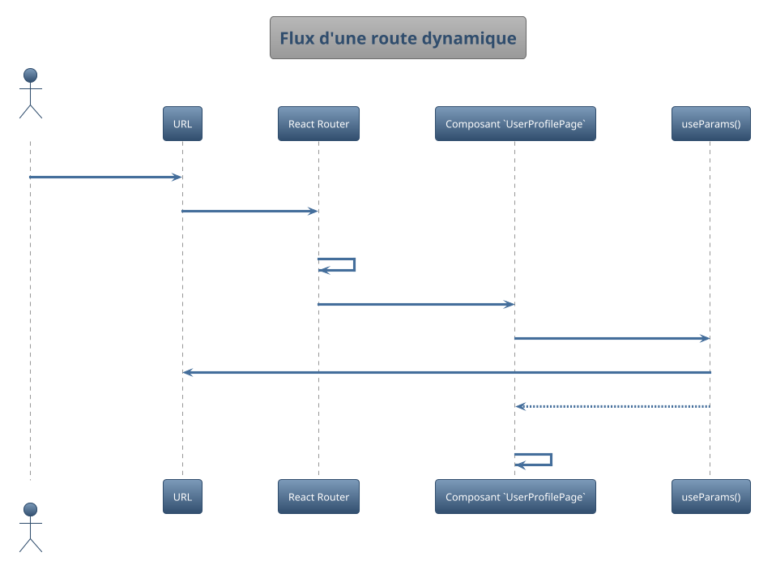

Parfait ! Votre application peut maintenant afficher des données dynamiques. Mais pour l'instant, elle se comporte comme
un document unique. Comment la transformer en une expérience multi-pages fluide, sans les rechargements complets du web
traditionnel ? C'est le rôle du routage côté client.

---

# Module 6 : Le Routage côté Client avec React Router

Bienvenue dans le monde des **Single Page Applications (SPA)**. L'idée est simple : l'utilisateur charge votre site une
seule fois, puis la navigation entre les "pages" est gérée directement par JavaScript dans le navigateur. C'est plus
rapide, plus fluide, et cela donne une sensation d'application de bureau.

Dans ce module, nous allons découvrir la bibliothèque la plus populaire pour gérer cela en React : **React Router**.
Vous apprendrez à définir des routes, à créer des liens de navigation et à construire des applications qui ont plusieurs
vues distinctes.

## Objectifs Pédagogiques

À la fin de ce module, vous serez capable de :

* **Expliquer** le concept de routage côté client et ses avantages pour une SPA.
* **Configurer** React Router dans une application pour définir différentes routes.
* **Utiliser** le composant `<Link>` pour créer une navigation déclarative sans rechargement de page.
* **Déclencher** une navigation par programmation avec le hook `useNavigate`.
* **Créer** des routes dynamiques pour afficher des pages de détails (ex: `/utilisateurs/:id`).
* **Récupérer** les paramètres d'une URL avec le hook `useParams`.
* **Mettre en place** un système de routes protégées basique pour contrôler l'accès à certaines pages.

## Pourquoi ce module est-il important ?

Imaginez que votre application est un grand musée. Sans React Router, c'est un musée avec une seule immense salle. Tout
y est exposé en même temps : l'accueil, la collection égyptienne, la boutique de souvenirs... C'est le chaos.

React Router est l'architecte qui va concevoir le plan du musée. Il va créer des salles distinctes (`Routes`), des
couloirs pour y accéder (`<Link>`), et des panneaux de signalisation (`URLs`). L'utilisateur peut se déplacer d'une
salle à l'autre de manière intuitive, et l'expérience est bien plus agréable. Chaque salle a une adresse unique (
`/egypte`, `/boutique`), ce qui permet aussi de partager un lien direct vers une section précise du musée. Maîtriser le
routage est la compétence qui transforme votre collection de composants en une application structurée et navigable.

## Compétences du Référentiel (REAC)

Ce module est fondamental pour la construction d'applications web complètes et s'intègre parfaitement au **CCP-1 :
Concevoir et développer des composants d'interface utilisateur**.

* **Maquetter une application :** Le routage est une partie intégrante de la conception de l'architecture et du flux de
  navigation d'une application.
* **Développer une interface utilisateur de type desktop :** Les SPA imitent le comportement des applications natives,
  où la navigation entre les écrans est instantanée.
* **Développer des composants d'interface utilisateur :** Nous allons créer des composants spécifiques à chaque "page" (
  route) de l'application.

---

## 1. Installation et configuration

La première étape est d'ajouter React Router à notre projet et de configurer la structure de base.

`npm install react-router-dom`

<procedure title="L'analogie de l'aiguilleur de train">
<p>
Pour faire fonctionner un réseau de trains, vous avez besoin de plusieurs choses :
</p>
<ol>
    <li>Un <b>contexte global</b> qui connaît tout le réseau. C'est le rôle de <code>&lt;BrowserRouter&gt;</code>. On l'enroule autour de toute notre application.</li>
    <li>Une <b>zone d'aiguillage</b> principale où les décisions sont prises. C'est le composant <code>&lt;Routes&gt;</code>.</li>
    <li>Des <b>règles d'aiguillage</b> spécifiques : "Si le train a la destination '/contact', envoie-le sur cette voie". Chaque règle est un composant <code>&lt;Route&gt;</code>.</li>
</ol>
</procedure>

**Configuration de base :**

<tabs>
<tab title="index.js">

```javascript
// src/index.js
import React from 'react';
import ReactDOM from 'react-dom/client';
import { BrowserRouter } from 'react-router-dom';
import App from './App';

const root = ReactDOM.createRoot(document.getElementById('root'));
root.render(
  <React.StrictMode>
    {/* On enveloppe notre App avec BrowserRouter */}
    <BrowserRouter>
      <App />
    </BrowserRouter>
  </React.StrictMode>
);

```
</tab>
<tab title="App.js">

```javascript
// src/App.js
import React from 'react';
import { Routes, Route } from 'react-router-dom';
import HomePage from './pages/HomePage';
import AboutPage from './pages/AboutPage';
import ContactPage from './pages/ContactPage';
import NotFoundPage from './pages/NotFoundPage';

function App() {
return (
<div>
{/* Ici on pourrait mettre une barre de navigation persistante */}
<h1>Mon Application</h1>
<nav>
{/* ... liens de navigation ici ... */}
</nav>

      {/* L'aiguilleur principal */}
      <Routes>
        {/*
          Chaque Route est une règle :
          - `path` : l'URL à surveiller.
          - `element` : le composant à afficher si l'URL correspond.
        */}
        <Route path="/" element={<HomePage />} />
        <Route path="/about" element={<AboutPage />} />
        <Route path="/contact" element={<ContactPage />} />
        
        {/* Une route "catch-all" pour les URL inconnues */}
        <Route path="*" element={<NotFoundPage />} />
      </Routes>
    </div>

);
}

export default App;


```
</tab>
</tabs>

---

## 2. Navigation

Maintenant que nos routes sont définies, comment permettre à l'utilisateur de se déplacer entre elles ?

#### Navigation déclarative avec `<Link>`

<warning title="Ne jamais utiliser de balise `<a>` !">

Si vous utilisez `<a href="/about">À propos</a>`, vous demandez au navigateur de faire un rechargement complet de la page. Cela détruit tout l'intérêt d'une SPA ! React Router perd le contrôle.

</warning>

La bonne pratique est d'utiliser le composant `<Link>` fourni par React Router.

<procedure title="L'analogie du téléporteur">
<p>
Une balise <code>&lt;a&gt;</code>, c'est comme prendre sa voiture pour aller à l'autre bout de la ville. Il faut sortir du garage, prendre la route, se garer... C'est lent.
</p>
<p>
Le composant <code>&lt;Link&gt;</code>, c'est un téléporteur. En apparence, c'est une porte, mais quand vous la franchissez, vous êtes instantanément à destination, sans temps de trajet. Il modifie l'URL dans la barre d'adresse et demande à React d'afficher le bon composant, le tout sans quitter l'application.
</p>
</procedure>


```javascript
// src/components/NavBar.js
import React from 'react';
import { Link, NavLink } from 'react-router-dom';

function NavBar() {
  return (
    <nav>
      <ul>
        <li>
          {/* On utilise `to` au lieu de `href` */}
          <Link to="/">Accueil</Link>
        </li>
        <li>
          {/* NavLink est une variante de Link qui sait quand elle est active.
              Parfait pour ajouter une classe CSS et styliser le lien actif. */}
          <NavLink 
            to="/about" 
            className={({ isActive }) => isActive ? 'active-link' : ''}
          >
            À Propos
          </NavLink>
        </li>
        <li>
          <Link to="/contact">Contact</Link>
        </li>
      </ul>
    </nav>
  );
}

```

#### Navigation programmatique avec `useNavigate`

Parfois, vous devez naviguer suite à une action, comme la soumission d'un formulaire ou une condition logique. Dans ces
cas, on ne peut pas utiliser `<Link>`. On utilise le hook `useNavigate`.


```javascript
import {useNavigate} from 'react-router-dom';

function LoginForm() {
    const navigate = useNavigate();

    const handleSubmit = (event) => {
        event.preventDefault();
        // ... logique de connexion ...

        // Si la connexion réussit, on redirige l'utilisateur.
        const isLoginSuccessful = true; // Simulé
        if (isLoginSuccessful) {
            navigate('/dashboard');
        }
    };

    return <form onSubmit={handleSubmit}>{/* ... */}</form>;
}

```

---

## 3. Routes Dynamiques

Imaginez un site de blog. Vous n'allez pas créer une route pour chaque article ! Vous avez besoin d'un "modèle" de route
qui peut correspondre à n'importe quel article. C'est le but des routes dynamiques.

<procedure title="L'analogie des adresses postales">
<p>
Une route statique (<code>/contact</code>) est comme l'adresse du siège social d'une entreprise. Elle est unique et fixe.
</p>
<p>
Une route dynamique (<code>/employes/:id</code>) est comme un modèle pour l'adresse de n'importe quel employé. La rue est la même, mais le numéro de l'appartement (l'<code>:id</code>) change. Le facteur sait qu'il doit aller à la bonne rue, puis chercher le bon numéro d'appartement.
</p>
<p>
Le composant qui gère cette route doit ensuite être capable de lire ce numéro d'appartement pour afficher les informations de la bonne personne. C'est le rôle du hook <code>useParams</code>.
</p>
</procedure>

On définit un segment dynamique dans l'URL avec un deux-points (`:`).

**Étape 1 : Définir la route dynamique**


```javascript
// Dans App.js
import UserProfilePage from './pages/UserProfilePage';

<Routes>
    <Route path="/" element={<HomePage/>}/>
    {/* Le `:userId` est un paramètre dynamique */}
    <Route path="/users/:userId" element={<UserProfilePage/>}/>
</Routes>

```

Cette route correspondra à `/users/1`, `/users/alice`, `/users/123-abc`, etc.

**Étape 2 : Récupérer le paramètre dans le composant**
On utilise le hook `useParams` qui retourne un objet contenant les paramètres de l'URL.


```javascript
// src/pages/UserProfilePage.js
import React from 'react';
import {useParams} from 'react-router-dom';

function UserProfilePage() {
    // useParams() retourne un objet : { userId: 'valeur_dans_url' }
    const {userId} = useParams();

    // On peut maintenant utiliser cet ID pour fetcher les données
    // de l'utilisateur spécifique.
    // useEffect(() => {
    //   fetch(`https://api.example.com/users/${userId}`)
    // }, [userId]);

    return (
        <div>
            <h1>Profil de l'utilisateur</h1>
            <p>ID de l'utilisateur : {userId}</p>
        </div>
    );
}

```




### Exercice 16 : Créer une page de détail de produit

**Objectif :** Créer une navigation entre une liste de produits et la page de détail de chaque produit.

1. Créez une page `ProductListPage` qui affiche une liste de produits (en dur, ex: "Produit 1", "Produit 2").
2. Chaque nom de produit doit être un `<Link>` pointant vers `/products/{id_du_produit}`.
3. Créez une page `ProductDetailPage`.
4. Dans `App.js`, configurez les routes : `/products` pour la liste et `/products/:productId` pour le détail.
5. Dans `ProductDetailPage`, utilisez `useParams` pour récupérer le `productId` et affichez-le.

#### Correction exercice 16 {collapsible="true"}

<tabs>
<tab title="pages/ProductListPage.js">

```javascript
import React from 'react';
import { Link } from 'react-router-dom';

const products = [
{ id: 1, name: 'Ordinateur Portable' },
{ id: 2, name: 'Smartphone' },
{ id: 3, name: 'Casque audio' },
];

function ProductListPage() {
return (
<div>
<h2>Nos produits</h2>
<ul>
{products.map(product => (
<li key={product.id}>
{/* Le lien pointe vers une URL dynamique */}
<Link to={`/products/${product.id}`}>{product.name}</Link>
</li>
))}
</ul>
</div>
);
}
export default ProductListPage;

```
</tab>
<tab title="pages/ProductDetailPage.js">

```javascript
import React from 'react';
import { useParams, Link } from 'react-router-dom';

function ProductDetailPage() {
const { productId } = useParams();

// Dans une vraie app, on utiliserait cet ID pour fetcher les données
return (
<div>
<h1>Détails du Produit</h1>
<p>Vous consultez le produit avec l'ID : <strong>{productId}</strong></p>
<Link to="/products">Retour à la liste</Link>
</div>
);
}
export default ProductDetailPage;


```
</tab>
<tab title="App.js">

```javascript
import { Routes, Route } from 'react-router-dom';
import ProductListPage from './pages/ProductListPage';
import ProductDetailPage from './pages/ProductDetailPage';
// ... autres imports ...

function App() {
return (
<div>
<nav>
<Link to="/products">Produits</Link>
</nav>
<Routes>
{/* Autres routes */}
<Route path="/products" element={<ProductListPage />} />
<Route path="/products/:productId" element={<ProductDetailPage />} />
</Routes>
</div>
);
}

```

</tab>
</tabs>

---

## 4. Routes Protégées

Certaines pages de votre application ne devraient être accessibles qu'aux utilisateurs connectés (un tableau de bord, un
profil...). Une route protégée est un composant qui vérifie une condition (l'utilisateur est-il authentifié ?) avant de
rendre la page demandée. Si la condition n'est pas remplie, il redirige l'utilisateur.


```javascript
import React from 'react';
import {Navigate, Outlet} from 'react-router-dom';

// Simule un hook d'authentification
const useAuth = () => {
    // Dans une vraie app, ceci viendrait d'un contexte ou de Redux
    const user = {loggedIn: true};
    return user && user.loggedIn;
};

function ProtectedRoute() {
    const isAuth = useAuth();

    // Si l'utilisateur est authentifié, on rend le composant enfant
    // que React Router nous passe via <Outlet />.
    // Sinon, on le redirige vers la page de connexion.
    return isAuth ? <Outlet/> : <Navigate to="/login"/>;
}

// Utilisation dans App.js
<Routes>
    <Route path="/login" element={<LoginPage/>}/>
    {/* On "enveloppe" nos routes protégées */}
    <Route element={<ProtectedRoute/>}>
        <Route path="/dashboard" element={<DashboardPage/>}/>
        <Route path="/profile" element={<ProfilePage/>}/>
    </Route>
</Routes>

```

L'élément `<Outlet />` agit comme un placeholder, indiquant où les composants enfants de la route (`DashboardPage`,
`ProfilePage`) doivent être rendus.

---

## TP : Construire une mini-application de blog

Mettons tout en pratique pour construire un blog simple avec une page d'accueil, une liste d'articles et des pages de
détail pour chaque article.

### Étape 1 : Structure des pages

* Créez les composants de page suivants : `HomePage.js`, `BlogPage.js`, `PostPage.js`, et `NotFoundPage.js`.
* `HomePage` : Un simple message de bienvenue.
* `BlogPage` : Récupère et affiche une liste de titres d'articles depuis `https://jsonplaceholder.typicode.com/posts`.
  Chaque titre doit être un `<Link>` vers la page de détail de cet article (`/blog/:postId`).
* `PostPage` : Utilise `useParams` pour obtenir le `postId`, puis récupère et affiche les détails de cet article
  spécifique depuis `https://jsonplaceholder.typicode.com/posts/:postId` (titre et contenu).
* `NotFoundPage` : Affiche un message "404 - Page non trouvée".

### Étape 2 : Créer le Layout et la Navigation

* Créez un composant `Layout.js`. Il contiendra la structure commune à toutes les pages : un `header` avec un `<nav>`,
  un `main` où le contenu des pages sera affiché, et un `footer`.
* Dans le `main`, utilisez le composant `<Outlet />`.
* La `nav` doit contenir des `NavLink` vers l'accueil (`/`) et le blog (`/blog`).

### Étape 3 : Configurer les Routes

* Dans `App.js`, mettez en place la structure des routes.
* Utilisez la route `Layout` comme route parente pour que la navigation soit toujours visible.
* Définissez les routes enfants pour `/`, `/blog`, `/blog/:postId` et `*`.

### Correction du TP {collapsible="true"}

<tabs>
<tab title="components/Layout.js">

```javascript
import React from 'react';
import { NavLink, Outlet } from 'react-router-dom';
import './Layout.css';

function Layout() {
return (
<div className="layout">
<header>
<h1>Mon Blog Technique</h1>
<nav>
<NavLink to="/">Accueil</NavLink>
<NavLink to="/blog">Blog</NavLink>
</nav>
</header>
<main>
{/* Le contenu des routes enfants sera injecté ici */}
<Outlet />
</main>
<footer>
<p>© 2024 Mon Blog</p>
</footer>
</div>
);
}

export default Layout;


```
</tab>
<tab title="pages/BlogPage.js">

```javascript
import React from 'react';
import { Link } from 'react-router-dom';
import useFetch from '../hooks/useFetch'; // On réutilise notre hook !

function BlogPage() {
  const { data: posts, loading, error } = useFetch(
    'https://jsonplaceholder.typicode.com/posts'
  );

  if (loading) return <p>Chargement des articles...</p>;
  if (error) return <p>Erreur de chargement.</p>;

  return (
    <div>
      <h2>Tous les articles</h2>
      <ul>
        {posts && posts.map(post => (
          <li key={post.id}>
            <Link to={`/blog/${post.id}`}>{post.title}</Link>
          </li>
        ))}
      </ul>
    </div>
  );
}

export default BlogPage;

```

</tab>
<tab title="pages/PostPage.js">

```javascript
import React from 'react';
import { useParams, Link } from 'react-router-dom';
import useFetch from '../hooks/useFetch';

function PostPage() {
const { postId } = useParams();
const { data: post, loading, error } = useFetch(
`https://jsonplaceholder.typicode.com/posts/${postId}`
);

if (loading) return <p>Chargement de l'article...</p>;
if (error) return <p>Erreur de chargement de l'article.</p>;

return (
<article>
{post && (
<>
<h2>{post.title}</h2>
<p>{post.body}</p>
</>
)}
<Link to="/blog">Retour au blog</Link>
</article>
);
}

export default PostPage;


```
</tab>
<tab title="App.js (Routes)">

```javascript
import React from 'react';
import { Routes, Route } from 'react-router-dom';
import Layout from './components/Layout';
import HomePage from './pages/HomePage';
import BlogPage from './pages/BlogPage';
import PostPage from './pages/PostPage';
import NotFoundPage from './pages/NotFoundPage';

function App() {
  return (
    <Routes>
      {/* Toutes les routes suivantes partageront le même Layout */}
      <Route path="/" element={<Layout />}>
        {/* La page d'accueil à la racine */}
        <Route index element={<HomePage />} />
        
        {/* Les routes du blog */}
        <Route path="blog" element={<BlogPage />} />
        <Route path="blog/:postId" element={<PostPage />} />
        
        {/* La route pour les pages non trouvées */}
        <Route path="*" element={<NotFoundPage />} />
      </Route>
    </Routes>
  );
}

// Les composants HomePage et NotFoundPage sont de simples composants
// affichant un message, leur code n'est pas inclus pour la brièveté.

export default App;

```

</tab>
</tabs>

---

## Auto-évaluation

Testez vos connaissances ! Les réponses se trouvent à la toute fin du support de cours.

#### Questions à Choix Multiple (QCM)

**1. Quel composant de `react-router-dom` faut-il utiliser pour créer un lien de navigation qui ne recharge pas la
page ?**

1. `<a href="...">`
2. `<Route path="...">`
3. `<Navigate to="...">`
4. `<Link to="...">`

**2. Vous avez une route définie comme `<Route path="/invoices/:invoiceId" element={<Invoice />}>`. Comment le
composant `Invoice` peut-il accéder à la valeur de `invoiceId` ?**

1. Via `props.invoiceId`.
2. En utilisant `const { invoiceId } = useParams();`.
3. En lisant `window.location.href`.
4. En utilisant `const navigate = useNavigate();`.

**3. Quel est le rôle du composant `<Outlet />` ?**

1. Il sert à définir une route qui n'est accessible que si l'utilisateur est déconnecté.
2. C'est un placeholder qui indique où rendre le composant d'une route enfant dans un layout parent.
3. C'est un alias pour le composant `<Link />`.
4. Il gère les redirections 404.

#### Questions Ouvertes

**4. Expliquez la différence entre la navigation déclarative et la navigation programmatique en React Router. Donnez un
cas d'utilisation pour chacune.**

**5. Vous construisez une application avec un tableau de bord (`/dashboard`), des paramètres (`/settings`) et une page
de connexion (`/login`). Décrivez comment vous structureriez vos routes pour que `/dashboard` et `/settings` ne soient
accessibles qu'aux utilisateurs authentifiés.**

---

## Conclusion de ce module

Vous avez transformé votre application d'une simple page en une véritable application web multi-vues. Vous avez
maintenant le pouvoir de structurer la navigation de manière logique et intuitive pour vos utilisateurs.

Vous savez comment définir des **routes**, créer des liens avec `<Link>`, gérer des URL dynamiques avec `useParams`, et
même protéger certaines parties de votre application. Avec React Router, vous avez ajouté une dimension essentielle à
vos compétences, vous permettant de construire des expériences utilisateur complètes et professionnelles.

Maintenant que les utilisateurs peuvent naviguer et voir des données, la prochaine étape logique est de leur permettre
d'en *créer* et d'en *modifier*. Le prochain module se concentrera sur l'un des aspects les plus interactifs du
développement web : **la gestion des formulaires**.

## Suggestions de projets pour pratiquer

1. **Niveau Débutant : Site vitrine simple**
    * **Description :** Créez un site de 3 pages : Accueil, À propos, Contact.
    * **Piste technique :** C'est l'exercice de base pour pratiquer `<BrowserRouter>`, `<Routes>`, `<Route>`, et
      `<NavLink>` pour la barre de navigation.

2. **Niveau Intermédiaire : Clone de Wikipédia simplifié**
    * **Description :** Une page d'accueil avec un champ de recherche. La recherche mène à une page de résultats.
      Cliquer sur un résultat mène à la page de l'article.
    * **Piste technique :** Utilisez l'API de MediaWiki. Pratiquez `useNavigate` pour la redirection après la recherche
      et `useParams` pour la page de l'article.

3. **Niveau Avancé : Mini-plateforme e-commerce**
    * **Description :** Une application avec une page listant des catégories de produits, une page listant les produits
      d'une catégorie, et une page de détail pour chaque produit. Ajoutez une fausse page de connexion et protégez une
      page "Mon Compte".
    * **Piste technique :** C'est un excellent projet pour combiner le routage imbriqué (
      `/categories/:categoryId/products/:productId`), les routes protégées, et la récupération de données dynamique
      basée sur les paramètres de l'URL.