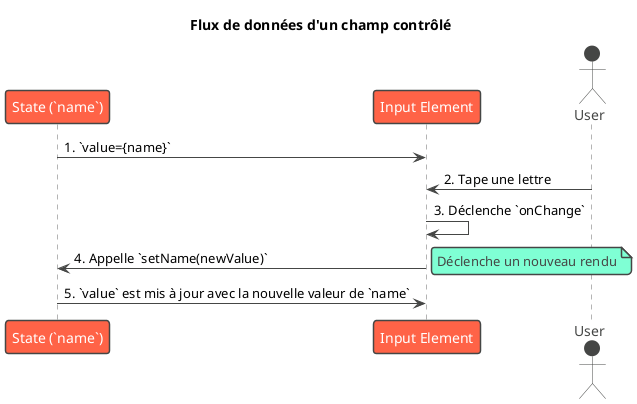

Parfaitement. Nous arrivons à un point crucial de l'interaction utilisateur. Nos applications peuvent afficher des
données, les utilisateurs peuvent naviguer entre les pages, mais comment leur permettre de soumettre leurs propres
informations ? C'est le rôle des formulaires.

---

# Module 7 : Gestion des Formulaires

Les formulaires sont partout sur le web. Inscription, connexion, publication d'un message, recherche, paiement... ils
sont le principal moyen pour les utilisateurs de communiquer des informations à votre application. Cependant, leur
gestion en React peut rapidement devenir complexe : il faut suivre la valeur de chaque champ, gérer la validation,
afficher les erreurs et traiter la soumission.

Dans ce module, nous allons explorer les stratégies pour maîtriser les formulaires en React, de l'approche native à l'
utilisation de bibliothèques dédiées qui vous feront gagner un temps précieux.

## Objectifs Pédagogiques

À la fin de ce module, vous serez capable de :

* **Implémenter** des formulaires en utilisant la stratégie des **champs contrôlés** (`controlled components`).
* **Comprendre** et utiliser la stratégie des **champs non contrôlés** (`uncontrolled components`) avec `useRef`.
* **Gérer** les événements de formulaire comme `onChange` et `onSubmit`.
* **Mettre en place** une validation de base côté client.
* **Expliquer** les avantages d'utiliser une bibliothèque de gestion de formulaires.
* **Construire** des formulaires complexes, performants et faciles à maintenir avec la bibliothèque **React Hook Form**.

## Pourquoi ce module est-il important ?

Imaginez que vous êtes un agent de recensement. Vous devez collecter des informations précises auprès des citoyens.

* **L'approche "non contrôlée" :** Vous donnez un questionnaire papier à une personne et vous revenez le chercher plus
  tard. Vous n'avez aucune idée de ce qu'elle écrit avant la fin. C'est simple au début, mais si elle fait une erreur,
  vous ne le saurez qu'à la fin, et il sera peut-être trop tard pour corriger.
* **L'approche "contrôlée" :** Vous posez les questions une par une et vous notez vous-même les réponses sur votre
  carnet. Vous avez un contrôle total en temps réel. Si une réponse est invalide ("Quelle est votre année de
  naissance ?" -> "Hier"), vous pouvez le signaler immédiatement. C'est plus de travail pour vous, mais le résultat est
  beaucoup plus fiable.

Ce module vous apprendra à être cet agent de recensement efficace. Vous saurez quand utiliser la méthode simple et quand
il est crucial d'avoir un contrôle total. Plus important encore, vous découvrirez des assistants (les bibliothèques) qui
automatisent la plupart de ce travail pour vous, vous laissant vous concentrer sur les questions importantes.

## Compétences du Référentiel (REAC)

La gestion des formulaires est une compétence fondamentale du **CCP-1 : Concevoir et développer des composants
d'interface utilisateur**.

* **Développer une interface utilisateur :** Les formulaires sont un composant central de la plupart des interfaces
  interactives.
* **Développer des composants d’accès aux données :** La soumission d'un formulaire résulte presque toujours en un envoi
  de données vers une API (requêtes POST, PUT, PATCH).
* **Maquetter une application :** La conception des formulaires, y compris la gestion des états de validation et
  d'erreur, est une partie essentielle du maquettage.

---

## 1. Champs Contrôlés (Controlled Components)

C'est la méthode **recommandée et la plus courante** en React. L'idée est simple : l'état de React est la **source
unique de vérité** pour la valeur du champ de formulaire.

<procedure title="Le principe du thermostat">
<p>
Un champ contrôlé fonctionne comme un thermostat moderne.
</p>
<ol>
    <li>L'<b>état React</b> (ex: <code>const [temperature, setTemperature] = useState(20)</code>) est la température de consigne.</li>
    <li>Le thermostat (le <code>&lt;input&gt;</code>) <b>affiche</b> toujours cette valeur (<code>value={temperature}</code>). Il est "contrôlé" par l'état.</li>
    <li>Quand vous tournez le bouton du thermostat (vous tapez dans le champ), cela déclenche un événement (<code>onChange</code>).</li>
    <li>Cet événement ne change pas directement l'affichage. Il appelle une fonction (<code>setTemperature</code>) pour demander une <b>mise à jour de l'état</b>.</li>
    <li>L'état est mis à jour, ce qui provoque un nouveau rendu, et le thermostat affiche la nouvelle valeur.</li>
</ol>
<p>
Le flux est circulaire : <b>État → UI → Action → État</b>. Cela garantit que ce que vous voyez est toujours synchronisé avec l'état de votre application.
</p>
</procedure>

**Exemple concret : Un champ de saisie simple**


```javascript
import React, {useState} from 'react';

function ControlledForm() {
    // L'état est la source de vérité
    const [name, setName] = useState('');

    const handleChange = (event) => {
        // On met à jour l'état à chaque frappe
        setName(event.target.value.toUpperCase()); // On peut même transformer la donnée
    };

    const handleSubmit = (event) => {
        event.preventDefault(); // Empêche le rechargement de la page
        alert(`Le nom soumis est : ${name}`);
    };

    return (
        <form onSubmit={handleSubmit}>
            <label>
                Nom :
                <input
                    type="text"
                    // La valeur affichée est TOUJOURS celle de l'état
                    value={name}
                    // L'événement onChange met à jour l'état
                    onChange={handleChange}
                />
            </label>
            <button type="submit">Soumettre</button>
        </form>
    );
}

```




---

## 2. Champs Non Contrôlés (Uncontrolled Components)

Parfois, vous n'avez pas besoin de contrôler la valeur à chaque frappe. Vous voulez juste récupérer la valeur finale
lorsque le formulaire est soumis. Dans ce cas, on peut laisser le DOM gérer l'état du champ lui-même.

<procedure title="Le principe de la boîte aux lettres">
<p>
Un champ non contrôlé est comme une boîte aux lettres. Les gens (l'utilisateur) peuvent y déposer du courrier (taper du texte) quand ils le veulent. Vous, le propriétaire (React), n'allez pas vérifier la boîte à chaque seconde. Vous attendez le moment opportun (la soumission du formulaire), puis vous ouvrez la boîte avec votre clé (une <code>ref</code>) pour récupérer tout le courrier d'un coup.
</p>
</procedure>

On utilise une `ref` pour obtenir un accès direct à l'élément du DOM au moment de la soumission.

**Exemple avec `useRef`**


```javascript
import React, {useRef} from 'react';

function UncontrolledForm() {
    // On crée une ref pour "s'accrocher" à l'élément input
    const nameInputRef = useRef(null);

    const handleSubmit = (event) => {
        event.preventDefault();
        // On accède à la valeur via la ref au moment de la soumission
        alert(`Le nom soumis est : ${nameInputRef.current.value}`);
    };

    return (
        <form onSubmit={handleSubmit}>
            <label>
                Nom :
                {/* L'input n'a pas de prop `value` ou `onChange` liée à l'état React.
            Il est "non contrôlé". `defaultValue` peut être utilisé pour la valeur initiale. */}
                <input type="text" ref={nameInputRef} defaultValue="John Doe"/>
            </label>
            <button type="submit">Soumettre</button>
        </form>
    );
}

```

| Critère              | Champs Contrôlés                                               | Champs Non Contrôlés                                         |
|:---------------------|:---------------------------------------------------------------|:-------------------------------------------------------------|
| **Source de vérité** | **État React (`useState`)**                                    | **DOM**                                                      |
| **Validation**       | Instantanée (à chaque `onChange`)                              | À la soumission (`onSubmit`)                                 |
| **Flux de données**  | Unidirectionnel (React → DOM)                                  | Le DOM gère son propre état                                  |
| **Complexité**       | Plus de code, mais plus de contrôle                            | Moins de code, plus simple                                   |
| **Cas d'usage**      | Validation en temps réel, champs dynamiques, masques de saisie | Formulaires très simples, intégration avec du code non-React |

---

## 3. Librairies de Formulaires : React Hook Form

Gérer un formulaire avec plusieurs champs, des validations complexes, des messages d'erreur et l'état de soumission peut
vite devenir un cauchemar avec l'approche contrôlée native (beaucoup de `useState` et de re-rendus).

**React Hook Form** est une bibliothèque qui résout ces problèmes avec brio.

<procedure title="L'analogie de l'assistant personnel pour formulaires">
<p>
React Hook Form est un assistant ultra-compétent que vous engagez pour gérer vos formulaires. Vous lui donnez simplement les instructions :
</p>
<ul>
    <li>"<b>Enregistre</b> (<code>register</code>) ce champ 'email' pour moi. Il doit être obligatoire et ressembler à une adresse email."</li>
    <li>"Dis-moi s'il y a des <b>erreurs</b> (<code>formState: { errors }</code>) pour que je puisse les afficher."</li>
    <li>"Quand l'utilisateur clique sur 'Soumettre', donne-moi directement un <b>objet propre avec toutes les données</b>, mais seulement si tout est valide."</li>
</ul>
<p>
L'assistant s'occupe de toute la logique interne, des re-rendus optimisés (il s'appuie sur des refs, ce qui est très performant), et vous donne juste les informations dont vous avez besoin.
</p>
</procedure>

**Installation :** `npm install react-hook-form`

**Exemple : Formulaire d'inscription avec validation**


```javascript
import React from 'react';
import {useForm} from 'react-hook-form';

function RegistrationForm() {
    const {
        register,          // Fonction pour enregistrer un input
        handleSubmit,      // Gère la soumission, ne s'exécute que si la validation passe
        formState: {errors} // Objet contenant les erreurs de validation
    } = useForm();

    // Cette fonction ne sera appelée que si le formulaire est valide
    const onSubmit = (data) => {
        console.log("Données valides soumises :", data);
    };

    return (
        // On passe notre fonction `onSubmit` à `handleSubmit`
        <form onSubmit={handleSubmit(onSubmit)}>
            <div>
                <label>Email</label>
                <input
                    {...register('email', {
                        required: 'L\'email est obligatoire',
                        pattern: {
                            value: /^\S+@\S+$/i,
                            message: 'Le format de l\'email est invalide'
                        }
                    })}
                />
                {/* Affiche le message d'erreur s'il existe pour ce champ */}
                {errors.email && <p className="error">{errors.email.message}</p>}
            </div>

            <div>
                <label>Mot de passe</label>
                <input
                    type="password"
                    {...register('password', {
                        required: 'Le mot de passe est obligatoire',
                        minLength: {
                            value: 8,
                            message: 'Le mot de passe doit faire au moins 8 caractères'
                        }
                    })}
                />
                {errors.password && <p className="error">{errors.password.message}</p>}
            </div>

            <button type="submit">S'inscrire</button>
        </form>
    );
}

```

### Exercice 17 : Créer un formulaire de contact

**Objectif :** Créer un formulaire de contact simple en utilisant React Hook Form.

1. Le formulaire doit avoir trois champs : `name` (texte), `email` (email), et `message` (textarea).
2. Le champ `name` doit être obligatoire.
3. Le champ `email` doit être obligatoire et avoir un format valide.
4. Le champ `message` doit être obligatoire et avoir une longueur minimale de 10 caractères.
5. Affichez les messages d'erreur correspondants sous chaque champ.
6. Lors de la soumission, affichez les données dans la console.

#### Correction exercice 17 {collapsible="true"}


```javascript
import React from 'react';
import {useForm} from 'react-hook-form';
import './Form.css'; // Pour styliser les erreurs

function ContactForm() {
    const {
        register,
        handleSubmit,
        formState: {errors}
    } = useForm({
        // mode: 'onBlur' // On peut choisir de valider au changement, au blur, etc.
    });

    const onSubmit = (data) => {
        alert('Formulaire envoyé !');
        console.log(data);
    };

    return (
        <form onSubmit={handleSubmit(onSubmit)}>
            <div className="form-control">
                <label htmlFor="name">Nom</label>
                <input
                    id="name"
                    {...register('name', {required: 'Le nom est obligatoire.'})}
                />
                {errors.name && <p className="error-message">{errors.name.message}</p>}
            </div>

            <div className="form-control">
                <label htmlFor="email">Email</label>
                <input
                    id="email"
                    {...register('email', {
                        required: 'L\'email est obligatoire.',
                        pattern: {
                            value: /^\S+@\S+$/i,
                            message: 'Email invalide.'
                        }
                    })}
                />
                {errors.email && <p className="error-message">{errors.email.message}</p>}
            </div>

            <div className="form-control">
                <label htmlFor="message">Message</label>
                <textarea
                    id="message"
                    rows="5"
                    {...register('message', {
                        required: 'Le message ne peut pas être vide.',
                        minLength: {
                            value: 10,
                            message: 'Le message doit contenir au moins 10 caractères.'
                        }
                    })}
                />
                {errors.message && <p className="error-message">{errors.message.message}</p>}
            </div>

            <button type="submit">Envoyer</button>
        </form>
    );
}

export default ContactForm;

```

---

## TP : Formulaire d'ajout d'événement en plusieurs étapes

Créons un formulaire plus complexe qui guide l'utilisateur à travers plusieurs étapes, en utilisant React Hook Form pour
gérer l'état global du formulaire.

### Étape 1 : Le setup

* Utilisez `useState` pour gérer l'étape actuelle du formulaire (ex: `const [step, setStep] = useState(1);`).
* Installez et configurez `useForm` dans le composant principal du formulaire.

### Étape 2 : Première étape - Informations de base

* Si `step` est 1, affichez les champs :
    * `eventName` (texte, obligatoire)
    * `eventDate` (date, obligatoire)
* Affichez un bouton "Suivant". Ce bouton ne doit pas soumettre le formulaire, mais simplement vérifier la validité des
  champs de l'étape 1 et passer à l'étape 2.
* **Astuce :** `handleSubmit` peut être utilisé sans `onSubmit` pour simplement déclencher la validation. Ou mieux,
  utilisez la fonction `trigger()` de React Hook Form pour valider des champs spécifiques.

### Étape 3 : Deuxième étape - Détails du lieu

* Si `step` est 2, affichez les champs :
    * `locationName` (texte, obligatoire)
    * `locationAddress` (texte, obligatoire)
* Affichez un bouton "Précédent" (qui fait `setStep(1)`) et un bouton "Soumettre" (qui est de type `submit`).

### Étape 4 : Soumission et résumé

* Le bouton "Soumettre" doit déclencher le `handleSubmit` de `useForm`.
* La fonction `onSubmit` recevra toutes les données des deux étapes.
* Affichez un résumé des données soumises dans une alerte ou dans la console.

### Correction du TP {collapsible="true"}


```javascript
import React, {useState} from 'react';
import {useForm} from 'react-hook-form';
import './Form.css';

function MultiStepEventForm() {
    const [currentStep, setCurrentStep] = useState(1);
    const {
        register,
        handleSubmit,
        trigger, // Fonction pour déclencher la validation manuellement
        formState: {errors},
    } = useForm();

    // La fonction de soumission finale
    const processForm = (data) => {
        console.log('Données finales :', data);
        alert('Événement créé avec succès !');
    };

    // Passe à l'étape suivante si les champs actuels sont valides
    const handleNextStep = async () => {
        const fieldsToValidate = currentStep === 1 ? ['eventName', 'eventDate'] : [];
        const isValid = await trigger(fieldsToValidate);
        if (isValid) {
            setCurrentStep(currentStep + 1);
        }
    };

    const handlePrevStep = () => {
        setCurrentStep(currentStep - 1);
    };

    return (
        <form onSubmit={handleSubmit(processForm)}>
            {currentStep === 1 && (
                <section>
                    <h2>Étape 1: Informations de base</h2>
                    <div className="form-control">
                        <label>Nom de l'événement</label>
                        <input {...register('eventName', {required: 'Ce champ est requis.'})} />
                        {errors.eventName && <p className="error-message">{errors.eventName.message}</p>}
                    </div>
                    <div className="form-control">
                        <label>Date de l'événement</label>
                        <input type="date" {...register('eventDate', {required: 'Ce champ est requis.'})} />
                        {errors.eventDate && <p className="error-message">{errors.eventDate.message}</p>}
                    </div>
                </section>
            )}

            {currentStep === 2 && (
                <section>
                    <h2>Étape 2: Lieu</h2>
                    <div className="form-control">
                        <label>Nom du lieu</label>
                        <input {...register('locationName', {required: 'Ce champ est requis.'})} />
                        {errors.locationName && <p className="error-message">{errors.locationName.message}</p>}
                    </div>
                    <div className="form-control">
                        <label>Adresse</label>
                        <input {...register('locationAddress', {required: 'Ce champ est requis.'})} />
                        {errors.locationAddress && <p className="error-message">{errors.locationAddress.message}</p>}
                    </div>
                </section>
            )}

            <div className="navigation-buttons">
                {currentStep > 1 && (
                    <button type="button" onClick={handlePrevStep}>
                        Précédent
                    </button>
                )}
                {currentStep < 2 && (
                    <button type="button" onClick={handleNextStep}>
                        Suivant
                    </button>
                )}
                {currentStep === 2 && (
                    <button type="submit">
                        Créer l'événement
                    </button>
                )}
            </div>
        </form>
    );
}

export default MultiStepEventForm;

```

---

## Auto-évaluation

Testez vos connaissances ! Les réponses se trouvent à la toute fin du support de cours.

#### Questions à Choix Multiple (QCM)

**1. Quelle est la "source unique de vérité" pour la valeur d'un champ de formulaire contrôlé ?**

1. La propriété `value` de l'élément DOM.
2. L'état React, géré par `useState`.
3. Une `ref` pointant vers l'input.
4. Les `props` passées au composant.

**2. Quel est le principal avantage de performance de React Hook Form par rapport à une approche "champs contrôlés"
native ?**

1. Il utilise des Web Workers pour la validation.
2. Il minimise les re-rendus du composant car il s'appuie sur des champs non contrôlés (refs).
3. Il est écrit dans un langage plus rapide que JavaScript.
4. Il ne fait aucune validation.

**3. Dans React Hook Form, que fait la fonction `handleSubmit` ?**

1. Elle envoie directement les données du formulaire à un serveur.
2. Elle empêche la soumission du formulaire et appelle votre fonction `onSubmit` uniquement si la validation est
   réussie.
3. Elle doit être appelée dans un `useEffect`.
4. Elle sert à réinitialiser les champs du formulaire.

#### Questions Ouvertes

**4. Décrivez un scénario où l'utilisation de champs non contrôlés avec `useRef` pourrait être préférable à celle de
champs contrôlés.**

**5. Vous construisez un formulaire avec un champ "Confirmer le mot de passe". Comment implémenteriez-vous la validation
pour vous assurer que ce champ correspond au champ "Mot de passe" en utilisant React Hook Form ?**

---

## Conclusion de ce module

Vous avez maintenant une maîtrise complète de l'une des parties les plus interactives et essentielles du développement
web. Vous savez non seulement comment collecter des données auprès des utilisateurs, mais aussi comment le faire de
manière robuste, efficace et avec une excellente expérience utilisateur.

Vous avez appris la différence fondamentale entre les **champs contrôlés** et **non contrôlés**, ce qui vous permet de
choisir la bonne stratégie pour chaque situation. Plus important encore, vous avez découvert la puissance de **React
Hook Form**, une bibliothèque qui va vous faire gagner d'innombrables heures de développement tout en améliorant la
performance de vos applications.

Avec la navigation, la récupération de données et maintenant la gestion des formulaires dans votre boîte à outils, vous
êtes prêt à construire des applications complètes. Mais comment s'assurer que tout cela est bien organisé et facile à
maintenir sur le long terme ? Le prochain module se concentre sur l'**architecture et les bonnes pratiques** pour
structurer votre code de manière professionnelle.

## Suggestions de projets pour pratiquer

1. **Niveau Débutant : Calculateur d'IMC**
    * **Description :** Un formulaire avec deux champs : poids (kg) et taille (cm). Un bouton "Calculer" affiche
      l'Indice de Masse Corporelle et une interprétation simple.
    * **Piste technique :** Un excellent exercice pour les champs contrôlés. La validation peut se faire en temps réel (
      `onChange`) pour s'assurer que seules des valeurs numériques positives sont entrées.

2. **Niveau Intermédiaire : Formulaire de réservation d'hôtel**
    * **Description :** Un formulaire pour réserver une chambre, avec des champs pour les dates d'arrivée et de départ,
      le nombre d'adultes et d'enfants, et le type de chambre (select).
    * **Piste technique :** Utilisez React Hook Form. Implémentez des validations complexes, par exemple : la date de
      départ doit être postérieure à la date d'arrivée.

3. **Niveau Avancé : Formulaire d'inscription avec connexion à une fausse API**
    * **Description :** Un formulaire d'inscription complet (email, mot de passe, confirmation de mot de passe). À la
      soumission, envoyez les données avec `axios` à une fausse API (comme `reqres.in`). Gérez les états de soumission (
      affichage d'un spinner sur le bouton) et affichez les messages d'erreur ou de succès retournés par l'API.
    * **Piste technique :** C'est un projet complet qui combine les compétences de ce module et du module sur les APIs.
      Utilisez la propriété `isSubmitting` de `formState` dans React Hook Form pour désactiver le bouton et afficher un
      indicateur de chargement.