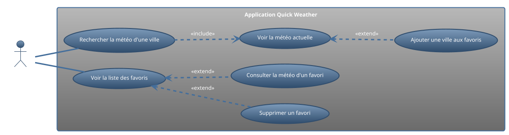
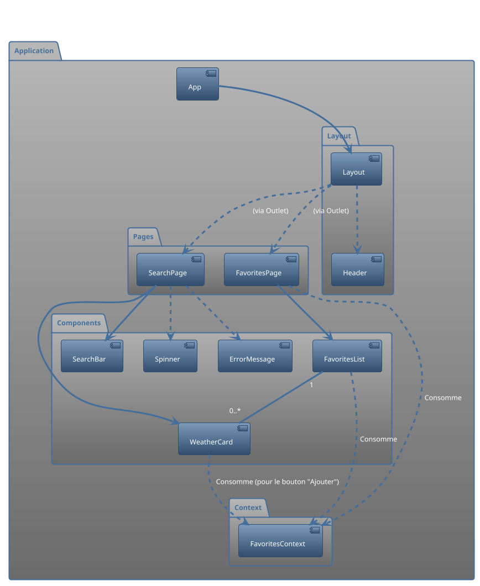

# Projet de Synthèse : "Quick Weather" - Votre Météo en un clin d'œil

**Concept :** Une application web simple, épurée et rapide pour consulter la météo actuelle d'une ville et gérer une
liste de villes favorites.

**Objectifs Pédagogiques Clés :**

* **Hooks :** `useState`, `useEffect`, `useContext`, `useCallback`.
* **Appels API :** Utilisation d'Axios et gestion des états `loading`/`error`.
* **Routage :** Navigation entre la page de recherche et la page des favoris avec React Router.
* **Gestion de l'état :** Un état global simple avec `useContext` pour les favoris.
* **Formulaires :** Un champ de recherche contrôlé.
* **Architecture & Style :** Structure de dossiers propre, séparation conteneur/présentation.

**API à utiliser :** [OpenWeatherMap](https://openweathermap.org/api). L'inscription est gratuite et fournit une clé d'
API quasi-instantanément.

---

## 1. Diagrammes UML

### Diagramme de Cas d'Utilisation

### Diagramme de Composants

---

## 2. User Stories & Tâches Techniques

### User Story 1 : Recherche de Météo

**En tant qu'utilisateur, je veux pouvoir rechercher une ville pour voir sa météo actuelle afin de savoir comment
m'habiller.**

| Tâche Technique                             | Description Détaillée                                                                                                                                          | Estimation |
|:--------------------------------------------|:---------------------------------------------------------------------------------------------------------------------------------------------------------------|:-----------|
| **T1.1 : Créer la page de recherche**       | Créer le composant `SearchPage.js`. Il gérera l'état de la recherche (ville recherchée, données météo, chargement, erreur).                                    | 15 min     |
| **T1.2 : Créer le composant `SearchBar`**   | Composant de présentation avec un `<input>` contrôlé et un bouton `<button>`. Il reçoit la valeur de la recherche et une fonction `onSubmit` en props.         | 30 min     |
| **T1.3 : Mettre en place l'appel API**      | Dans `SearchPage`, créer une fonction (enveloppée dans `useCallback`) qui utilise `axios` pour appeler l'API OpenWeatherMap (`weather?q={city}`).              | 45 min     |
| **T1.4 : Gérer les états de la requête**    | Utiliser `useState` dans `SearchPage` pour gérer `weatherData`, `loading`, `error`. Afficher les composants `Spinner` ou `ErrorMessage` en fonction.           | 30 min     |
| **T1.5 : Créer le composant `WeatherCard`** | Composant de présentation qui reçoit `data` en prop et affiche les informations clés : nom de la ville, température, description (ex: "Nuageux"), icône météo. | 45 min     |

### User Story 2 : Gestion des Favoris

**En tant qu'utilisateur, je veux pouvoir sauvegarder mes villes préférées pour y accéder rapidement plus tard.**

| Tâche Technique                                      | Description Détaillée                                                                                                                                                                                                                                                                       | Estimation |
|:-----------------------------------------------------|:--------------------------------------------------------------------------------------------------------------------------------------------------------------------------------------------------------------------------------------------------------------------------------------------|:-----------|
| **T2.1 : Créer le `FavoritesContext`**               | Créer un contexte pour gérer la liste des villes favorites (`favorites`) et les fonctions pour les manipuler (`addFavorite`, `removeFavorite`).                                                                                                                                             | 30 min     |
| **T2.2 : Envelopper l'application dans le Provider** | Dans `App.js`, créer la logique du provider (avec `useState` pour la liste des favoris) et envelopper l'application.                                                                                                                                                                        | 20 min     |
| **T2.3 : Ajouter le bouton "Favori"**                | Dans `WeatherCard`, utiliser `useContext` pour vérifier si la ville affichée est déjà en favori. Afficher un bouton "Ajouter aux favoris" ou "Retirer des favoris" en conséquence. Le clic appelle `addFavorite` ou `removeFavorite`.                                                       | 45 min     |
| **T2.4 : Créer la page `FavoritesPage`**             | Créer le composant `FavoritesPage.js`. Il utilise `useContext` pour récupérer la liste des favoris.                                                                                                                                                                                         | 15 min     |
| **T2.5 : Créer le composant `FavoritesList`**        | Composant qui reçoit la liste des favoris en prop. Il mappe sur la liste et pour chaque favori, il peut afficher un résumé ou, mieux, rendre un `WeatherCard` qui ira chercher ses propres données. Pour simplifier, on peut juste afficher le nom de la ville et un bouton pour supprimer. | 45 min     |

### User Story 3 : Navigation

**En tant qu'utilisateur, je veux pouvoir naviguer facilement entre la page de recherche et ma liste de favoris.**

| Tâche Technique                                | Description Détaillée                                                                                                                                               | Estimation |
|:-----------------------------------------------|:--------------------------------------------------------------------------------------------------------------------------------------------------------------------|:-----------|
| **T3.1 : Configurer React Router**             | Installer `react-router-dom`. Configurer les routes `/` (pour `SearchPage`) et `/favorites` (pour `FavoritesPage`) dans `App.js`.                                   | 20 min     |
| **T3.2 : Créer un Layout commun**              | Créer un composant `Layout.js` avec un `<header>` et un `<Outlet />`. Le `header` contiendra le `Header.js`.                                                        | 15 min     |
| **T3.3 : Créer le composant `Header`**         | Créer le composant `Header.js` qui contient le titre de l'application et des `<NavLink>` vers "/" et "/favorites". Utiliser une classe active pour le style.        | 20 min     |
| **T3.4 : Gérer les variables d'environnement** | Créer un fichier `.env.local` pour stocker la clé d'API OpenWeatherMap. Mettre à jour le code de l'appel API pour l'utiliser. Ajouter `.env.local` au `.gitignore`. | 15 min     |

---

## 3. Plan de Réalisation (Chronologie suggérée)

**Total estimé :** ~ 6.5 heures

### Matinée (3h30) - Le Cœur de la Fonctionnalité

1. **Setup du projet (30 min) :**
    * `npx create-vite quick-weather --template react`
    * Installer les dépendances : `npm install axios react-router-dom`
    * Nettoyer le projet initial et créer la structure de dossiers (`pages`, `components`, `hooks`, `contexts`).
    * Obtenir la clé d'API sur OpenWeatherMap et créer le fichier `.env.local`.

2. **Mettre en place le Routage et le Layout (45 min) :**
    * Configurer `BrowserRouter` dans `main.jsx`.
    * Créer les composants `Layout.js` et `Header.js` avec les `NavLink`.
    * Définir les `Routes` dans `App.js` avec les pages vides `SearchPage` et `FavoritesPage`.

3. **Construire la page de recherche (2h15) :**
    * Suivre les tâches **T1.1 à T1.5**.
    * Commencer par créer les composants de présentation vides (`SearchBar`, `WeatherCard`, `Spinner`, `ErrorMessage`).
    * Implémenter la logique dans `SearchPage` : état, appel API.
    * Relier le tout et s'assurer que la recherche d'une ville fonctionne et affiche la carte météo.

### Après-midi (3h00) - Favoris et Finitions

1. **Implémenter la gestion des favoris (2h00) :**
    * Suivre les tâches **T2.1 à T2.5**.
    * Créer et fournir le `FavoritesContext`.
    * Mettre à jour `WeatherCard` pour qu'il puisse ajouter/retirer un favori.
    * Construire la page des favoris pour qu'elle affiche la liste.

2. **Stylisation et Peaufinage (1h00) :**
    * Ajouter du CSS simple (via CSS Modules ou un fichier global) pour rendre l'application présentable.
    * Se concentrer sur la lisibilité : espacement, taille de police, couleurs.
    * Vérifier que les états de chargement et d'erreur sont bien gérés visuellement.

---

### Points de Blocage Potentiels et Solutions

* **Problèmes avec l'API :**
    * **"401 Unauthorized" :** La clé d'API est incorrecte ou n'est pas encore active. Vérifier la clé et attendre
      quelques minutes.
    * **"404 Not Found" :** La ville recherchée n'existe pas. Assurez-vous de gérer ce cas dans votre logique d'erreur.
    * **CORS :** Peu probable avec cette API, mais si ça arrive, c'est un problème serveur. On ne peut rien y faire si
      ce n'est utiliser une autre API.
* **Contexte qui ne se met pas à jour :**
    * Vérifier que la fonction qui modifie l'état (ex: `addFavorite`) crée bien un **nouveau** tableau (
      `setFavorites([...favorites, newFavorite])`) et ne mute pas l'ancien.
    * S'assurer que le composant qui consomme le contexte est bien un **enfant** du Provider.

