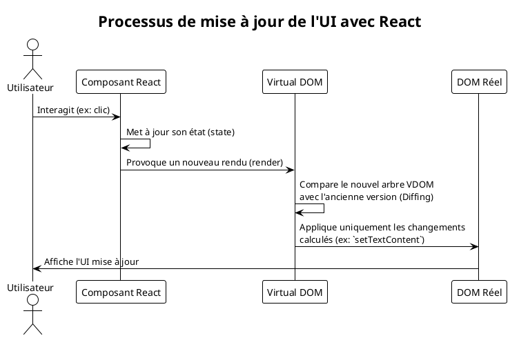
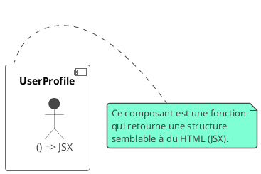
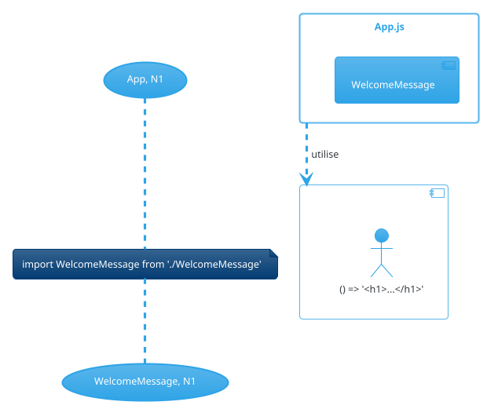
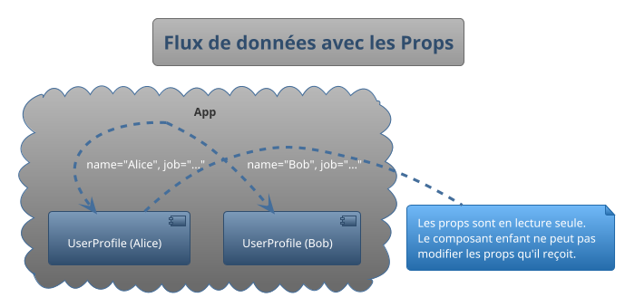
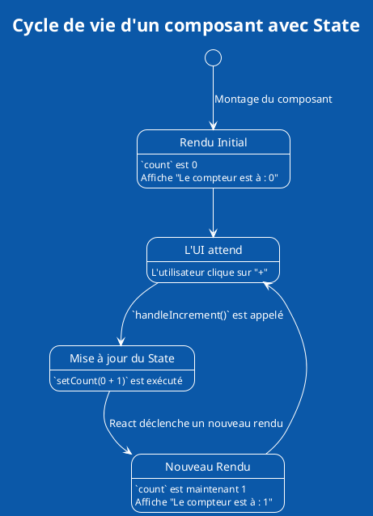
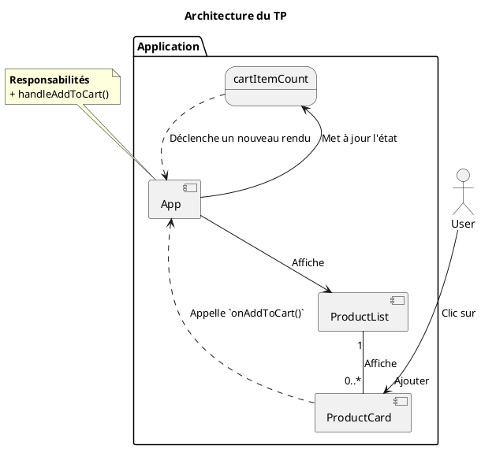

# Module 1 : Les Fondamentaux de React

Bienvenue dans ce premier module dédié aux fondamentaux de React ! C'est ici que nous allons poser les fondations
solides sur lesquelles vous construirez toutes vos futures applications. Considérez ce module comme l'apprentissage de
l'alphabet et de la grammaire d'une nouvelle langue. Une fois que vous maîtriserez ces bases, vous pourrez commencer à
écrire des "histoires" de plus en plus complexes et passionnantes.

## Objectifs Pédagogiques

À la fin de ce module, vous serez capable de :

* **Expliquer** ce qu'est React, sa philosophie et le rôle crucial du Virtual DOM.
* **Créer** des composants d'interface utilisateur réutilisables avec les fonctions JavaScript.
* **Utiliser** la syntaxe JSX pour décrire vos interfaces de manière déclarative et intuitive.
* **Faire communiquer** les composants entre eux en utilisant les `props` pour un flux de données clair et prévisible.
* **Gérer** l'état interne d'un composant pour le rendre dynamique et interactif grâce au hook `useState`.
* **Répondre** aux interactions de l'utilisateur en gérant les événements.

## Pourquoi ce module est-il important ?

Imaginez que vous deviez construire une voiture. Pourriez-vous commencer directement par la carrosserie ou le système
électronique ? Probablement pas. Vous commenceriez par le châssis, le squelette de la voiture. Ce module, c'est
exactement ça : le châssis de vos compétences React. Sans une maîtrise parfaite des composants, des props et du state,
toute application que vous construirez sera fragile.

En comprenant ces concepts fondamentaux, vous ne vous contenterez pas de "faire marcher" le code ; vous comprendrez
*pourquoi* il marche, ce qui vous permettra de déboguer plus vite, d'écrire du code plus performant et de concevoir des
applications plus robustes.

## Compétences du Référentiel (REAC)

Ce module couvre une partie essentielle du bloc de compétences **CCP-1 : Concevoir et développer des composants
d'interface utilisateur**.

* **Maquetter une application :** La compréhension des composants vous aide à décomposer une maquette en blocs logiques.
* **Développer une interface utilisateur de type desktop :** Les principes de React s'appliquent ici.
* **Développer des composants d’accès aux données :** Nous préparons le terrain pour aller chercher des données et les
  afficher.

---

## 1. Introduction à React

### Qu'est-ce que React ?

<procedure title="Découverte en douceur">
<p>
Imaginez que vous êtes un chef cuisinier dans un grand restaurant. Chaque jour, des centaines de commandes arrivent. Certaines sont simples, d'autres complexes. Votre défi ? Préparer chaque plat de manière cohérente, rapide et sans erreur.
</p>
<p>
Maintenant, imaginez votre interface utilisateur comme un grand plat complexe. Si un client veut juste "un peu moins de sel" (un petit changement dans les données), devez-vous jeter tout le plat et le refaire de zéro ? C'était souvent le cas avec les anciennes méthodes de développement web. C'était lent et source d'erreurs.
</p>
<p>
React vous propose une autre approche. Il vous dit : "Découpe ton plat en petits ingrédients réutilisables (un 'bouton', une 'barre de recherche', une 'carte produit'). Quand une commande de changement arrive, je sais exactement quel ingrédient modifier, et je le mets à jour très rapidement sans toucher au reste."
</p>
<p>
React est donc une **bibliothèque JavaScript** dont le but est de faciliter la création d'interfaces utilisateur interactives, performantes et réutilisables en les décomposant en petits morceaux appelés **composants**.
</p>
</procedure>

#### Bibliothèque vs Framework : La liberté de choisir ses outils

Avez-vous déjà acheté un kit de meubles à monter ? Le kit est un **framework** : il vous impose les pièces, les outils (
la petite clé Allen !), et les étapes de montage. Vous ne pouvez pas dévier du plan. Des frameworks comme Angular
fonctionnent un peu comme ça : ils vous donnent une structure très complète et opinionée pour toute votre application.

React, c'est différent. C'est une **bibliothèque**. Imaginez que vous alliez dans un grand magasin de bricolage. Vous
achetez une perceuse ultra-performante (React) pour une tâche précise : faire des trous (gérer l'interface utilisateur).
Pour le reste (les vis, les chevilles, le niveau à bulle), vous êtes libre de choisir les outils que vous préférez.
C'est la philosophie de React : il se concentre sur une seule chose et la fait exceptionnellement bien, vous laissant la
liberté de choisir d'autres bibliothèques pour gérer le routage, la gestion d'état global, etc.

#### Le Virtual DOM : Le cerveau de React

Comment React fait-il pour être si rapide ? Grâce à son "arme secrète" : le **Virtual DOM**.

* **Le DOM (Document Object Model) :** C'est la représentation de votre page HTML sous forme d'un arbre d'objets.
  Manipuler le vrai DOM est lent et coûteux en performance. C'est comme demander à un vrai maçon de déplacer un mur à
  chaque petite modification de plan.

* **Le Virtual DOM :** C'est une copie légère du DOM, une sorte de plan d'architecte, qui existe uniquement en mémoire
  JavaScript. Quand l'état de votre application change, React ne touche pas tout de suite au vrai mur. Il va :
    1. Créer une nouvelle version de son plan (un nouveau Virtual DOM).
    2. Comparer l'ancien plan avec le nouveau plan pour voir ce qui a *vraiment* changé (c'est l'étape de "diffing" ou "
       reconciliation").
    3. Une fois qu'il a identifié la différence minimale (ex: "seul le texte de ce bouton a changé"), il donne un ordre
       précis et unique au maçon (le vrai DOM) pour effectuer uniquement cette modification.

C'est ce qui rend React incroyablement performant. Il minimise les interactions coûteuses avec le DOM pour ne faire que
le strict nécessaire.



<activity title="Activité : Réflexion">
<p>
Pensez à une expérience passée où vous avez dû modifier une page web avec du JavaScript "vanilla" ou jQuery. Comment faisiez-vous pour mettre à jour un simple texte ou une couleur après un clic ? Décrivez les étapes. Comment le Virtual DOM aurait-il pu simplifier ce processus ?
</p>
</activity>

---

## 2. Les Composants : Le cœur de React

Si React était un jeu de LEGO, les composants seraient les briques. Ce sont des blocs de construction autonomes,
réutilisables, qui ont leur propre logique et leur propre apparence.

<procedure title="L'analogie des briques LEGO">
<p>
Vous pouvez avoir une petite brique 2x2 rouge (un `Button`), une brique 2x8 bleue (un `Input`), et en les assemblant, vous créez un composant plus grand, comme une `SearchBar`. Ensuite, vous pouvez assembler votre `SearchBar` avec un `Logo` et un `Menu` pour créer un composant `Header`. L'avantage ? Votre `Button` est réutilisable partout dans votre application, et si vous le mettez à jour (par exemple, en arrondissant ses coins), il sera mis à jour partout où il est utilisé !
</p>
</procedure>

### Les Composants Fonctionnels

Aujourd'hui, la manière la plus courante et la plus moderne d'écrire des composants est d'utiliser de simples fonctions
JavaScript.

Un composant fonctionnel est une fonction qui :

1. Prend en argument un objet de propriétés (`props`), que nous verrons juste après.
2. Retourne une description de ce qui doit être affiché à l'écran, en utilisant une syntaxe spéciale appelée JSX.

Voici à quoi ressemble votre toute première brique :

```javascript
// UserProfile.js

// Un composant est une fonction qui retourne du JSX.
// Le nom du composant commence toujours par une majuscule.
function UserProfile() {
    return (
        <div>
            <h2>John Doe</h2>
            <p>Développeur React</p>
        </div>
    );
}

// On exporte le composant pour pouvoir l'utiliser ailleurs.
export default UserProfile;
```



> **Avertissement : Les composants Classe**
> Vous rencontrerez peut-être dans des projets plus anciens ou des tutoriels une autre syntaxe pour créer des
> composants, utilisant les `class` JavaScript.
> ```javascript
> class OldComponent extends React.Component {
>   render() {
>     return <h1>Hello, world!</h1>;
>   }
> }
> ```
> Bien qu'il soit utile de savoir les reconnaître, la communauté React a massivement adopté les composants fonctionnels
> avec les "Hooks" (que nous verrons bientôt) car ils sont plus simples, plus concis et plus faciles à tester. **Nous
utiliserons exclusivement les composants fonctionnels dans ce cours.**

### Exercice 1 : Créez votre premier composant

**Objectif :** Créer un composant simple qui affiche un message de bienvenue.

1. Créez un nouveau fichier nommé `WelcomeMessage.js`.
2. Dans ce fichier, créez un composant fonctionnel nommé `WelcomeMessage`.
3. Ce composant doit retourner un titre `h1` contenant le texte "Bienvenue dans notre première application React !".
4. Exportez ce composant.

#### Correction exercice 1 {collapsible="true"}

```javascript
// WelcomeMessage.js

import React from 'react'; // Bonne pratique d'importer React

function WelcomeMessage() {
    // La parenthèse après le return est utile pour le JSX sur plusieurs lignes
    return (
        <h1>
            Bienvenue dans notre première application React !
        </h1>
    );
}

// On exporte le composant pour l'utiliser dans d'autres fichiers
export default WelcomeMessage;
```



---

## 3. JSX (JavaScript XML) : Écrire de l'HTML dans JavaScript

Vous avez remarqué la syntaxe étrange qui ressemble à de l'HTML dans nos composants ? C'est le JSX.

<procedure title="L'analogie de la recette de cuisine">
<p>
Imaginez que vous écrivez une recette. Le JSX, c'est comme si vous pouviez insérer directement une photo du plat final au milieu de la liste des ingrédients. C'est très visuel et intuitif.
</p>
<p>
Mais ce n'est pas juste une image ! Vous pouvez rendre cette photo dynamique. Par exemple : "Prenez {nombreOeufs} oeufs...". Si la variable `nombreOeufs` change dans votre code, la recette affichée se met à jour automatiquement.
</p>
<p>
JSX est une extension de la syntaxe de JavaScript qui nous permet d'écrire du code qui ressemble à de l'HTML directement dans nos fichiers JavaScript. C'est l'un des plus grands atouts de React car il rend le code de l'interface très lisible et facile à comprendre.
</p>
</procedure>

#### Syntaxe et différences clés avec HTML

Le JSX est très proche de l'HTML, mais avec quelques différences importantes :

* **`className` au lieu de `class` :** Le mot `class` est un mot-clé réservé en JavaScript. Pour assigner une classe
  CSS, on utilise donc `className`.
* **Les accolades `{}` pour les expressions JavaScript :** C'est la partie magique ! Tout ce qui se trouve entre
  accolades est interprété comme du JavaScript. Vous pouvez y mettre des variables, des appels de fonction, des
  opérations mathématiques...
* **Les balises auto-fermantes :** Toute balise doit être fermée. Une balise comme `` ou `<br>` en HTML doit
  s'écrire `` ou `<br />` en JSX.
* **Styles en ligne (inline styles) :** Ils s'écrivent avec un objet JavaScript, avec des propriétés en camelCase :
  `<div style={{ backgroundColor: 'blue', fontSize: '16px' }}>`.

**Exemple concret :**

```javascript
function UserCard() {
    const user = {
        firstName: 'Jane',
        lastName: 'Doe',
        avatarUrl: 'https://via.placeholder.com/150',
        jobTitle: 'Ingénieure Logiciel',
    };

    const cardClassName = 'user-card';

    return (
        // On utilise className pour les classes CSS
        <div className={cardClassName}>
            
            {/* On utilise les accolades pour afficher des variables */}
            <h2>{user.firstName} {user.lastName}</h2>
            {/* On peut même y mettre des conditions ternaires ! */}
            <p>
                {user.jobTitle ? user.jobTitle : 'Poste non renseigné'}
            </p>
        </div>
    );
}
```

> **Le saviez-vous ?**
> En coulisses, votre code JSX est transformé (on dit "transpilé") par un outil comme Babel en appels de fonction
`React.createElement()`.
> Le code `<h1 className="title">Bonjour</h1>` devient `React.createElement('h1', {className: 'title'}, 'Bonjour')`.
> Heureusement, nous n'avons presque jamais à écrire cela à la main !

### Exercice 2 : Intégrer des données dynamiques

**Objectif :** Créer un composant qui affiche les détails d'un produit en utilisant des variables et du JSX.

1. Créez un composant `ProductDetails`.
2. À l'intérieur de la fonction, créez un objet `product` avec les propriétés suivantes : `name` (string), `price` (
   number), et `inStock` (boolean).
3. Le composant doit retourner une `div` avec la classe CSS `product-info`.
4. À l'intérieur, affichez :
    * Le nom du produit dans un `h2`.
    * Le prix dans un `p` en formatant le texte comme suit : "Prix : XX €".
    * Un autre `p` qui affiche "En stock" si `inStock` est vrai, et "Rupture de stock" si c'est faux (utilisez un
      opérateur ternaire !).

#### Correction exercice 2 {collapsible="true"}

```javascript
// ProductDetails.js

import React from 'react';

function ProductDetails() {
    const product = {
        name: 'Casque audio sans fil',
        price: 99.90,
        inStock: true,
    };

    return (
        <div className="product-info">
            <h2>{product.name}</h2>
            {/* On peut faire des opérations directement dans les accolades */}
            <p>Prix : {product.price} €</p>
            <p>
                {/* Le ternaire est parfait pour le rendu conditionnel simple */}
                {product.inStock ? 'En stock' : 'Rupture de stock'}
            </p>
        </div>
    );
}

export default ProductDetails;
```

---

## 4. Les Props (Propriétés) : La communication Parent → Enfant

Nos composants sont bien, mais pour l'instant, ils sont statiques et isolés. Comment les rendre réutilisables et
dynamiques ? En leur passant des données ! C'est le rôle des `props`.

<procedure title="L'analogie du contrat de travail">
<p>
Imaginez qu'un composant "Parent" (le manager) engage un composant "Enfant" (l'employé) pour faire un travail. Le contrat de travail, ce sont les <b>props</b>. Le manager dit : "Voici tes instructions (tes props) : ton nom est 'Button', ta mission (ta couleur) est 'bleue', et le texte que tu dois afficher est 'Cliquez-moi'".
</p>
<p>
L'employé (`Button`) reçoit ces instructions et exécute le travail demandé. Il ne peut pas changer ses instructions lui-même. Si le manager veut qu'il devienne rouge, il doit lui donner un nouveau contrat (de nouvelles props). C'est ce qu'on appelle un <b>flux de données unidirectionnel</b> : les données descendent du parent vers l'enfant.
</p>
</procedure>

Les `props` sont un objet passé en premier argument de votre composant fonctionnel.

**Exemple concret :**

<tabs>
<tab title="Composant Parent (App.js)">

```javascript
// App.js
import React from 'react';
import UserProfile from './UserProfile';

function App() {
    return (
        <div>
            <h1>Mon équipe</h1>
            {/* 
        Ici, on passe les props `name` et `job` 
        au composant UserProfile.
        La syntaxe ressemble aux attributs HTML.
      */}
            <UserProfile name="Alice" job="Développeuse Frontend"/>
            <UserProfile name="Bob" job="Développeur Backend"/>
            <UserProfile name="Charlie" job="Designer UX/UI"/>
        </div>
    );
}

export default App;
```

</tab>
<tab title="Composant Enfant (UserProfile.js)">

```javascript
// UserProfile.js
import React from 'react';

// Le composant reçoit les props en paramètre.
// C'est un objet : { name: "Alice", job: "Développeuse Frontend" }
function UserProfile(props) {
    return (
        <div className="user-profile">
            {/* On accède aux valeurs via `props.nomDeLaProp` */}
            <h2>{props.name}</h2>
            <p>{props.job}</p>
        </div>
    );
}

// On peut aussi déstructurer les props pour un code plus propre :
// function UserProfile({ name, job }) {
//   return (
//     <div className="user-profile">
//       <h2>{name}</h2>
//       <p>{job}</p>
//     </div>
//   );
// }

export default UserProfile;
```

</tab>
</tabs>



#### `props.children` : une prop spéciale

Il existe une prop spéciale nommée `children`. Elle contient tout ce que vous placez *entre* la balise ouvrante et
fermante de votre composant. C'est très utile pour créer des composants "conteneurs" ou "wrappers".

**Exemple : Un composant `Card` qui met en valeur son contenu.**

```javascript
// Card.js
function Card(props) {
    // props.children contiendra le <h2> et le <p> passés depuis App.js
    return (
        <div className="card-container">
            {props.children}
        </div>
    );
}

// App.js
function App() {
    return (
        <Card>
            <h2>Titre de ma carte</h2>
            <p>Contenu de la carte qui sera passé via props.children.</p>
        </Card>
    );
}
```

> **Bonne pratique : validation et props par défaut**
> Pour rendre vos composants plus robustes, vous pouvez définir des valeurs par défaut pour les `props` et valider leur
> type. Historiquement, on utilisait la bibliothèque `prop-types`. Aujourd'hui, **TypeScript** est la solution la plus
> moderne et recommandée pour cela, car il vérifie les types à la compilation, évitant de nombreuses erreurs. Nous
> n'aborderons pas TypeScript dans ce module, mais sachez que c'est une compétence très recherchée.

### Exercice 3 : Rendre un composant réutilisable avec les props

**Objectif :** Transformer un bouton statique en un composant `Button` réutilisable.

1. Créez un composant `Button`.
2. Il doit accepter trois `props` :
    * `text` : le texte à afficher dans le bouton.
    * `type` : une chaîne de caractères qui peut être 'primary' ou 'secondary'.
    * `disabled` : un booléen pour activer/désactiver le bouton.
3. Le composant retourne un élément `<button>`.
4. Le `className` du bouton doit être `btn`. Si `type` est 'primary', il doit avoir la classe `btn-primary`. S'il est '
   secondary', `btn-secondary`.
5. Le texte du bouton doit venir de la prop `text`.
6. L'attribut `disabled` du bouton doit être lié à la prop `disabled`.

#### Correction exercice 3 {collapsible="true"}

```javascript
// Button.js
import React from 'react';

// On utilise la déstructuration pour un accès plus direct aux props
function Button({text, type = 'primary', disabled = false}) {
    // On définit des valeurs par défaut directement dans la signature

    const buttonClassName = `btn ${type === 'primary' ? 'btn-primary' : 'btn-secondary'}`;

    return (
        <button className={buttonClassName} disabled={disabled}>
            {text}
        </button>
    );
}

export default Button;


// Exemple d'utilisation dans un autre composant :
// function App() {
//   return (
//     <div>
//       <Button text="Valider" type="primary" />
//       <Button text="Annuler" type="secondary" />
//       <Button text="Envoyé" disabled={true} />
//     </div>
//   );
// }
```

---

## 5. Le State (État) et le Hook `useState`

Nous savons maintenant comment passer des données de haut en bas. Mais que se passe-t-il si un composant a besoin de se
souvenir de quelque chose qui peut changer au fil du temps, suite à une interaction de l'utilisateur ? C'est là qu'
intervient le **state**.

<procedure title="L'analogie de l'interrupteur">
<p>
Pensez à un simple interrupteur. Il a deux <b>états</b> possibles : "allumé" ou "éteint". Cette information lui est propre, elle est interne. Ce n'est pas la pièce ou la maison (les composants parents) qui décident de son état à chaque instant, c'est l'interrupteur lui-même qui le gère. Quand vous appuyez dessus, il change son propre état interne, et une conséquence visible se produit : la lumière s'allume ou s'éteint.
</p>
<p>
Le <b>state</b> d'un composant React, c'est sa mémoire interne. Ce sont des données qui lui appartiennent et qu'il peut modifier lui-même en réponse à des événements. Et le plus important : <b>quand le state d'un composant change, React le re-rend automatiquement pour que l'interface reflète ce changement.</b>
</p>
</procedure>

Pour gérer cet état dans un composant fonctionnel, React nous donne un outil spécial appelé un **Hook**. Le premier et
le plus important que nous allons voir est `useState`.

#### Syntaxe de `useState`

`useState` est une fonction qui nous retourne un tableau avec deux éléments :

1. La **valeur actuelle** de l'état.
2. Une **fonction pour mettre à jour** cette valeur.

```javascript
import {useState} from 'react';

// `useState(0)` : 0 est la valeur initiale de notre état.
const [count, setCount] = useState(0);

// `count` est notre variable d'état. Sa valeur est 0 au début.
// `setCount` est la seule fonction que nous devons utiliser pour modifier `count`.
```

**Exemple concret : Un compteur**

```javascript
import React, {useState} from 'react';

function Counter() {
    // 1. On déclare notre état 'count', initialisé à 0.
    const [count, setCount] = useState(0);

    // Fonction pour gérer le clic sur le bouton +
    const handleIncrement = () => {
        // 2. On utilise la fonction `setCount` pour mettre à jour l'état.
        // React va alors re-rendre ce composant.
        setCount(count + 1);
    };

    // Fonction pour gérer le clic sur le bouton -
    const handleDecrement = () => {
        setCount(count - 1);
    };

    return (
        <div>
            <p>Le compteur est à : {count}</p>
            <button onClick={handleIncrement}>+</button>
            <button onClick={handleDecrement}>-</button>
        </div>
    );
}
```



#### Le principe d'immuabilité

Une règle fondamentale avec le state de React : **ne jamais le modifier directement**.

<warning title="Ne mutez jamais l'état directement !">
<p>
Si votre état est un objet ou un tableau, ne faites jamais ceci :
</p>
<code-block lang="javascript">
// MAUVAIS ❌
const [user, setUser] = useState({ name: 'John', age: 30 });
user.age = 31; // Mutation directe ! React ne le détectera pas.
setUser(user);

// BON ✅
const [user, setUser] = useState({ name: 'John', age: 30 });
// On crée un NOUVEL objet en copiant les anciennes valeurs
// et en surchargeant celle qui doit changer.
setUser({ ...user, age: 31 });
</code-block>
<p>
React compare les références des objets pour savoir s'il doit faire un nouveau rendu. Si vous modifiez l'objet existant, sa référence en mémoire ne change pas, et React pensera que rien n'a changé. En créant un nouvel objet, vous garantissez que React détectera le changement.
</p>
</warning>

#### Différence fondamentale entre `props` et `state`

| Critère             | Props (Propriétés)                                                        | State (État)                                                      |
|:--------------------|:--------------------------------------------------------------------------|:------------------------------------------------------------------|
| **Origine**         | Viennent du **composant parent**.                                         | Géré **à l'intérieur** du composant lui-même.                     |
| **Modification**    | **Lecture seule**. Ne peuvent pas être modifiées par le composant enfant. | Peuvent être modifiées par le composant via la fonction `set...`. |
| **Flux de données** | Descendant (unidirectionnel).                                             | Interne au composant.                                             |
| **Analogie**        | Les réglages d'une machine définis à l'usine.                             | Les indicateurs sur le tableau de bord de la machine.             |

### Exercice 4 : Rendre un composant interactif

**Objectif :** Créer un bouton qui change de texte et de couleur à chaque clic.

1. Créez un composant `ToggleButton`.
2. Utilisez `useState` pour gérer un état `isOn`, qui sera un booléen (`true` ou `false`). Initialisez-le à `false`.
3. Le composant doit afficher un `<button>`.
4. Quand `isOn` est `true`, le bouton doit afficher le texte "ON" et avoir la classe CSS `btn-on`.
5. Quand `isOn` est `false`, il doit afficher "OFF" et avoir la classe `btn-off`.
6. Au clic sur le bouton, l'état `isOn` doit être inversé.

#### Correction exercice 4 {collapsible="true"}

```javascript
// ToggleButton.js
import React, {useState} from 'react';

// Supposons que vous ayez un fichier CSS avec les classes :
// .btn-on { background-color: green; color: white; }
// .btn-off { background-color: grey; color: white; }

function ToggleButton() {
    // Notre état pour savoir si le bouton est activé ou non
    const [isOn, setIsOn] = useState(false);

    // La fonction qui sera appelée au clic
    const handleClick = () => {
        // On met à jour l'état en passant la valeur inverse de l'actuelle
        setIsOn(!isOn);
    };

    return (
        <button
            onClick={handleClick}
            className={isOn ? 'btn-on' : 'btn-off'}
        >
            {isOn ? 'ON' : 'OFF'}
        </button>
    );
}

export default ToggleButton;
```

---

## 6. La Gestion des Événements

Nous venons de le voir avec le compteur et le bouton à bascule : pour rendre une application vivante, il faut réagir aux
actions de l'utilisateur. En React, la gestion des événements est très similaire à celle du HTML, mais avec une syntaxe
en `camelCase`.

* `onclick` en HTML devient `onClick` en React.
* `onchange` en HTML devient `onChange` en React.
* `onsubmit` en HTML devient `onSubmit` en React.

<procedure title="L'analogie du standard téléphonique">
<p>
Imaginez que chaque élément interactif de votre interface (un bouton, un champ de saisie) est un téléphone sur un grand standard. L'attribut `onClick` ou `onChange` est comme une étiquette à côté du téléphone qui dit : "Si ça sonne, transférez l'appel à tel opérateur (telle fonction)".
</p>
<p>
Vous ne passez pas le résultat de l'appel (vous n'écrivez pas `onClick={maFonction()}`), vous passez le numéro de l'opérateur lui-même (`onClick={maFonction}`). React se charge de faire sonner le bon téléphone et de connecter l'appel au bon opérateur quand l'événement se produit.
</p>
</procedure>

**Exemple : Gérer la saisie dans un champ de texte**

```javascript
import React, {useState} from 'react';

function NameForm() {
    const [name, setName] = useState('');

    // L'objet 'event' est automatiquement passé par le navigateur
    const handleChange = (event) => {
        // event.target.value contient le texte actuel de l'input
        setName(event.target.value);
    };

    return (
        <div>
            {/* 
        On lie la valeur de l'input à notre état `name`
        et on lie l'événement `onChange` à notre fonction `handleChange`.
        C'est ce qu'on appelle un "champ contrôlé".
      */}
            <input type="text" value={name} onChange={handleChange}/>
            <p>Votre nom est : {name}</p>
        </div>
    );
}
```

### Exercice 5 : Gérer une entrée utilisateur

**Objectif :** Créer un convertisseur de température simple (Celsius vers Fahrenheit).

1. Créez un composant `TempConverter`.
2. Utilisez `useState` pour stocker la température en Celsius, initialisée à `0`.
3. Affichez un champ de saisie (`<input type="number">`) dont la valeur est contrôlée par cet état.
4. À chaque changement dans le champ (`onChange`), mettez à jour l'état.
5. Affichez en dessous un paragraphe qui montre la température équivalente en Fahrenheit.
6. La formule est : `Fahrenheit = Celsius * 9/5 + 32`.

#### Correction exercice 5 {collapsible="true"}

```javascript
import React, {useState} from 'react';

function TempConverter() {
    const [celsius, setCelsius] = useState(0);

    const handleCelsiusChange = (event) => {
        // event.target.value est toujours une chaîne, on la convertit en nombre
        const value = event.target.value ? parseFloat(event.target.value) : 0;
        setCelsius(value);
    };

    // On calcule la valeur en Fahrenheit à chaque rendu.
    // Pas besoin d'un état séparé pour cela !
    const fahrenheit = celsius * 9 / 5 + 32;

    return (
        <div>
            <label>
                Température en Celsius :
                <input
                    type="number"
                    value={celsius}
                    onChange={handleCelsiusChange}
                />
            </label>
            <p>
                Équivalent en Fahrenheit : {fahrenheit.toFixed(2)} °F
            </p>
        </div>
    );
}

export default TempConverter;
```

---

## TP : Créer une mini boutique de produits

Mettons tout ce que nous avons appris en pratique pour créer une petite application interactive.

**Objectif :** Afficher une liste de produits et permettre à l'utilisateur d'ajouter des produits à un panier (nous ne
compterons que le nombre d'articles pour l'instant).

### Étape 1 : Créer le composant `ProductCard`

Ce composant sera notre "brique" de base pour afficher un produit. Il ne sera responsable que de l'affichage des
informations qu'on lui passe.

* Créez un fichier `ProductCard.js`.
* Le composant doit accepter en `props` :
    * `product` : un objet contenant `id`, `name`, `price`, et `imageUrl`.
    * `onAddToCart` : une fonction qui sera appelée quand on clique sur le bouton d'ajout.
* Il doit afficher l'image, le nom, et le prix du produit.
* Il doit avoir un bouton "Ajouter au panier" qui, au clic, appelle la fonction `onAddToCart`.

### Étape 2 : Créer le composant `ProductList`

Ce composant va récupérer une liste de produits et utiliser `ProductCard` pour afficher chacun d'entre eux.

* Créez un fichier `ProductList.js`.
* Le composant doit accepter en `props` :
    * `products` : un tableau d'objets produits.
    * `onAddToCart` : la même fonction que précédemment, qu'il passera à chaque `ProductCard`.
* Utilisez la méthode `.map()` sur le tableau `products` pour générer un `ProductCard` pour chaque produit.
* **Très important :** n'oubliez pas d'ajouter une prop `key` unique à chaque `ProductCard` dans la boucle, par exemple
  `key={product.id}`. React en a besoin pour optimiser le rendu des listes.

### Étape 3 : Assembler le tout dans `App.js`

C'est notre composant principal qui contiendra la logique et l'état.

* Dans `App.js`, créez un tableau de données de produits (au moins 3 produits).
* Utilisez `useState` pour créer un état `cartItemCount`, initialisé à `0`.
* Créez une fonction `handleAddToCart` qui incrémente `cartItemCount`.
* Affichez un en-tête avec le titre de la boutique et le nombre d'articles dans le panier (ex: "Panier (3)").
* Affichez le composant `ProductList`, en lui passant le tableau de produits et la fonction `handleAddToCart` en props.

### Correction du TP {collapsible="true"}

<tabs>
<tab title="ProductCard.js">

```javascript
// src/components/ProductCard.js
import React from 'react';

function ProductCard({product, onAddToCart}) {
    const {name, price, imageUrl} = product;

    return (
        <div className="product-card">
            
            <h3>{name}</h3>
            <p>{price.toFixed(2)} €</p>
            {/* 
        On appelle la fonction passée en prop au clic.
        On utilise une fonction fléchée pour s'assurer qu'elle
        n'est appelée qu'au moment du clic.
      */}
            <button onClick={() => onAddToCart(product.id)}>
                Ajouter au panier
            </button>
        </div>
    );
}

export default ProductCard;
```

</tab>
<tab title="ProductList.js">

```javascript
// src/components/ProductList.js
import React from 'react';
import ProductCard from './ProductCard';

function ProductList({products, onAddToCart}) {
    return (
        <div className="product-list">
            {products.map(product => (
                <ProductCard
                    // La 'key' est essentielle pour les performances de React
                    key={product.id}
                    product={product}
                    onAddToCart={onAddToCart}
                />
            ))}
        </div>
    );
}

export default ProductList;
```

</tab>
<tab title="App.js">

```javascript
// src/App.js
import React, {useState} from 'react';
import ProductList from './components/ProductList';
import './App.css'; // Pour un peu de style

const initialProducts = [
    {
        id: 1,
        name: 'React Mug',
        price: 12.50,
        imageUrl: 'https://via.placeholder.com/150'
    },
    {
        id: 2,
        name: 'Vue T-Shirt',
        price: 25.00,
        imageUrl: 'https://via.placeholder.com/150'
    },
    {
        id: 3,
        name: 'Angular Cap',
        price: 18.75,
        imageUrl: 'https://via.placeholder.com/150'
    },
];

function App() {
    const [products] = useState(initialProducts);
    const [cartItemCount, setCartItemCount] = useState(0);

    // C'est cette fonction qui détient la logique.
    // Elle est passée en props jusqu'au bouton.
    const handleAddToCart = (productId) => {
        console.log(`Produit ${productId} ajouté au panier !`);
        setCartItemCount(prevCount => prevCount + 1);
    };

    return (
        <div className="App">
            <header className="App-header">
                <h1>Ma Boutique React</h1>
                <p>Panier ({cartItemCount})</p>
            </header>
            <main>
                <ProductList products={products} onAddToCart={handleAddToCart}/>
            </main>
        </div>
    );
}

export default App;
```

</tab>

<tab title="Diagramme UML">





</tab>

</tabs>

---

## Auto-évaluation

Testez vos connaissances ! Les réponses se trouvent à la toute fin du support de cours.

#### Questions à Choix Multiple (QCM)

**1. Quelle est la principale différence entre les `props` et le `state` ?**

1. Les `props` sont utilisées pour les composants fonctionnels et le `state` pour les composants classe.
2. Les `props` sont modifiables par le composant enfant, alors que le `state` est en lecture seule.
3. Les `props` sont passées par le parent et sont en lecture seule, alors que le `state` est géré en interne par le
   composant et est modifiable.
4. Il n'y a pas de réelle différence, ce sont deux manières de nommer les données d'un composant.

**2. Que fait la ligne de code suivante : `const [isVisible, setIsVisible] = useState(true);` ?**

1. Elle crée une variable `isVisible` qui ne peut pas être modifiée.
2. Elle déclare une variable d'état `isVisible` avec la valeur initiale `true`, et une fonction `setIsVisible` pour la
   mettre à jour.
3. Elle crée une fonction `useState` qui retourne `true` ou `false`.
4. Elle crée une prop `isVisible` qui peut être passée à d'autres composants.

**3. Pourquoi l'attribut `key` est-il important lors du rendu d'une liste d'éléments en React ?**

1. Pour donner un style CSS unique à chaque élément.
2. C'est un identifiant global qui peut être utilisé pour accéder à l'élément depuis n'importe où dans l'application.
3. Il aide React à identifier quels éléments ont changé, ont été ajoutés ou supprimés, afin d'optimiser les mises à jour
   du DOM.
4. C'est une exigence de sécurité pour éviter les injections de code.

#### Questions Ouvertes

**4. Expliquez avec vos propres mots le concept de "flux de données unidirectionnel" dans React. Pourquoi est-ce un
avantage ?**

**5. Décrivez le rôle du Virtual DOM et le processus qu'il suit lorsqu'un état change dans un composant.**

---

## Conclusion de ce module

Félicitations ! Vous venez de terminer le premier et le plus important module de votre parcours avec React. Vous avez
posé des fondations extrêmement solides qui vous serviront tout au long de votre carrière de développeur.

Vous avez appris que React est une bibliothèque puissante pour construire des interfaces utilisateur basées sur une
architecture de **composants**, un peu comme un jeu de LEGO. Vous savez maintenant écrire ces composants, leur donner
une apparence avec **JSX**, les rendre réutilisables et configurables avec les **props**, et les rendre interactifs et
dynamiques grâce au **state** et aux **événements**.

Le voyage ne fait que commencer. Dans le prochain module, nous allons explorer comment gérer des actions plus complexes,
comme aller chercher des données sur un serveur, avec les **Hooks essentiels** comme `useEffect`. Préparez-vous à donner
encore plus de vie à vos applications !

## Suggestions de projets pour pratiquer

1. **Niveau Débutant : Générateur de citations**
    * **Description :** Une simple page qui affiche une citation et un auteur. Un bouton "Nouvelle citation" permet d'en
      afficher une autre au hasard.
    * **Piste technique :** Créez un tableau de citations en dur dans votre `App.js`. Utilisez `useState` pour garder en
      mémoire l'index de la citation actuellement affichée. Le clic sur le bouton génère un nouvel index aléatoire et
      met à jour l'état.

2. **Niveau Intermédiaire : Une interface de calculatrice**
    * **Description :** Créez l'interface d'une calculatrice standard. L'objectif n'est pas de rendre le calcul
      fonctionnel, mais de bien gérer l'affichage.
    * **Piste technique :** Un composant `Button` réutilisable pour tous les chiffres et opérateurs. Un état dans le
      composant principal `Calculator` pour stocker la chaîne de caractères actuellement affichée à l'écran. Chaque clic
      sur un bouton ajoute le caractère correspondant à cet état.

3. **Niveau Avancé : Une simple To-Do List**
    * **Description :** Une application permettant d'ajouter des tâches à une liste, de les marquer comme terminées et
      de les supprimer.
    * **Piste technique :** Utilisez un état pour stocker le tableau des tâches (ex:
      `useState([{ id: 1, text: 'Faire les courses', done: false }])`). Un champ de saisie contrôlé pour ajouter une
      nouvelle tâche. Pour la suppression ou le changement de statut, vous devrez passer des fonctions en props aux
      composants enfants qui, une fois appelées, mettront à jour le tableau dans le composant parent (pensez à
      l'immuabilité et utilisez `.map()` ou `.filter()` pour créer un nouveau tableau).